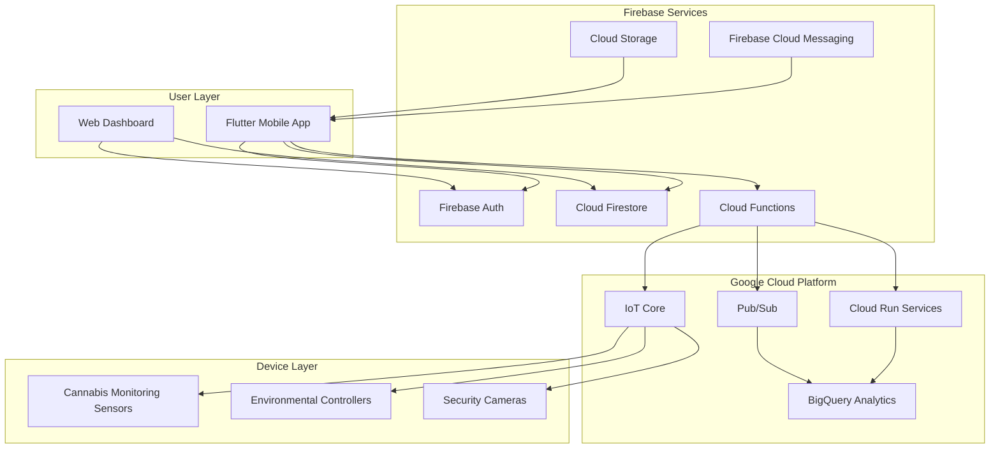
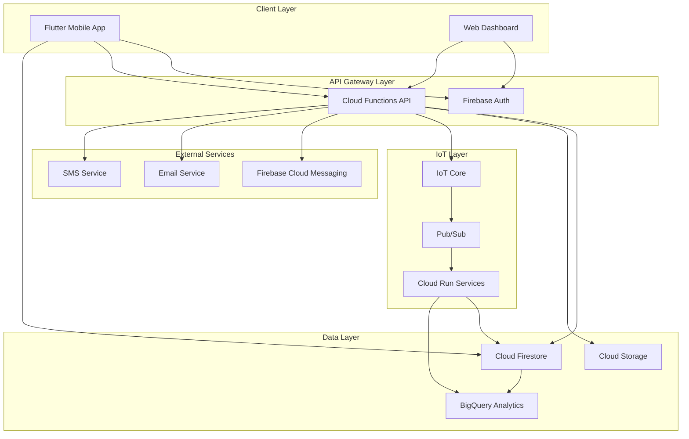
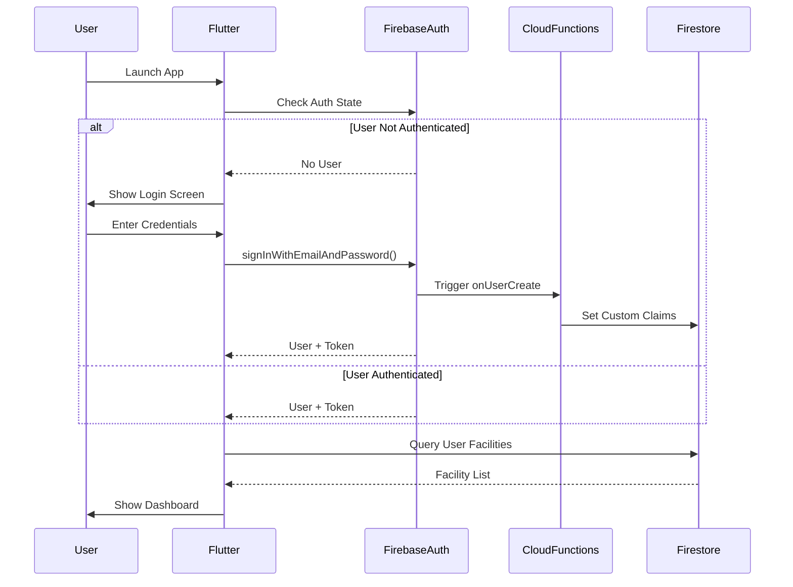
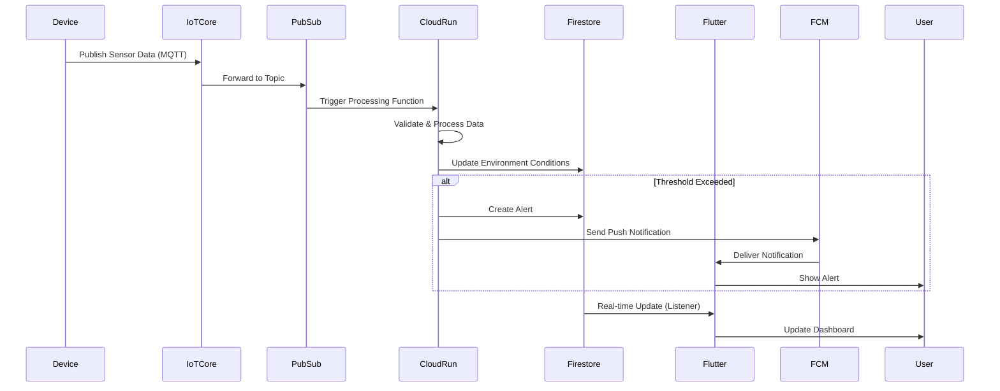
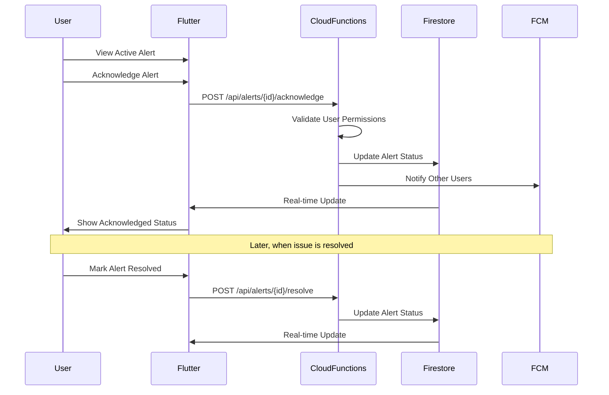
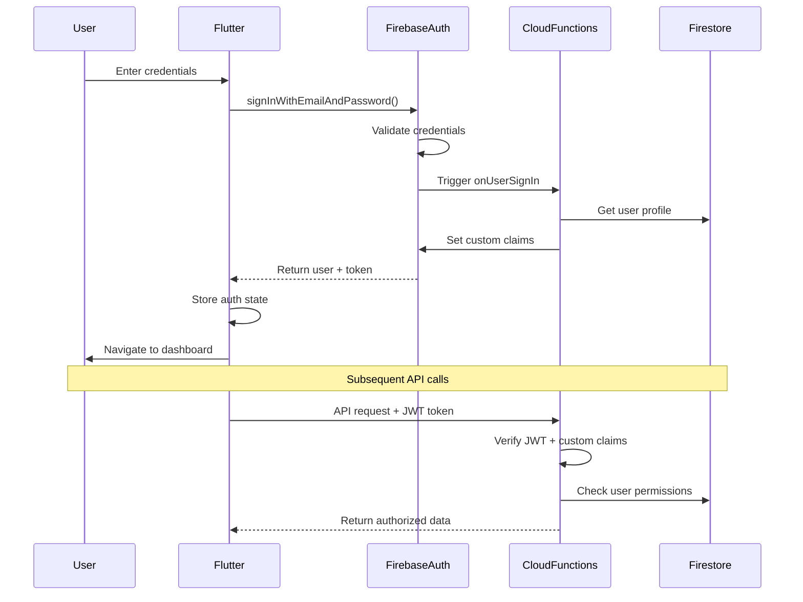
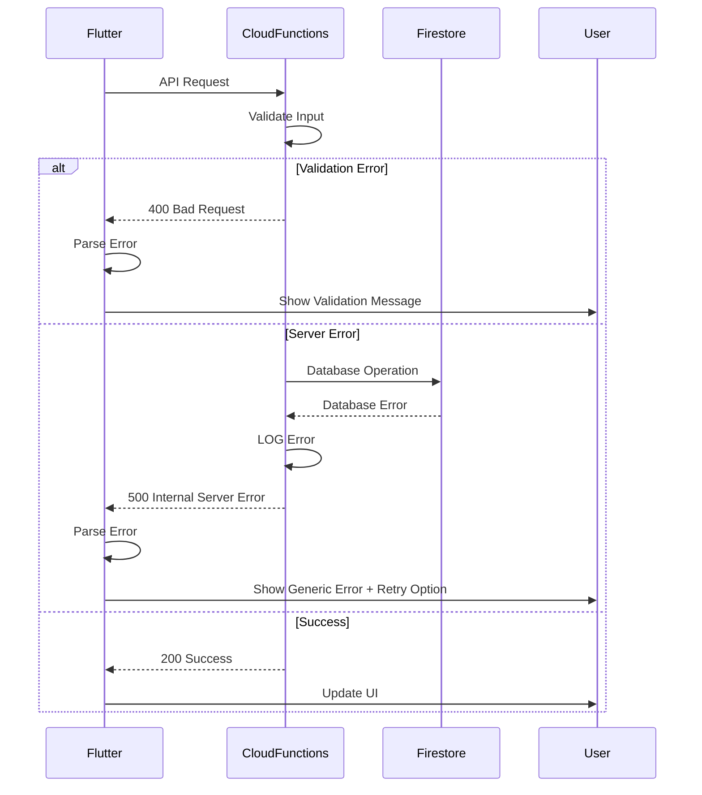

# Cannasol Technologies Mobile App Fullstack Architecture Document

## Introduction

This document outlines the complete fullstack architecture for Cannasol Technologies Mobile App, built on a **Firebase-centric foundation** that leverages your existing authentication, real-time database, and cloud functions infrastructure. The architecture extends and optimizes your current Firebase implementation to support industrial-scale cannabis monitoring while maintaining the simplicity and reliability you've already established.

This unified approach builds upon your proven Firebase + Flutter foundation, strategically expanding capabilities through additional Firebase services and complementary Google Cloud Platform services, ensuring seamless integration and consistent development patterns.

### Starter Template or Existing Project

**Firebase-Flutter Brownfield Project** - Building on established foundation:

- **Flutter/Dart mobile application** (primary interface) ✅ Implemented
- **Firebase Authentication** ✅ Implemented  
- **Cloud Firestore** for real-time data ✅ Implemented
- **Firebase Cloud Functions** for backend logic ✅ Implemented
- **Firebase Hosting** for web deployment ✅ Configured
- **Python services** integrated via Cloud Functions/Cloud Run

**Key Architectural Constraints:**

- Maintain Firebase as primary backend platform
- Preserve existing authentication flows and user data
- Extend current Firestore data models
- Build upon existing Cloud Functions patterns
- Leverage Firebase's offline-first mobile capabilities

### Change Log

| Date | Version | Description | Author |
|------|---------|-------------|---------|
| 2025-01-06 | 1.0 | Initial Firebase-centric fullstack architecture | Winston (Architect) |

## High Level Architecture

### Technical Summary

The Cannasol Technologies Mobile App employs a Firebase-centric serverless architecture with Flutter as the primary mobile interface, leveraging Cloud Firestore for real-time data synchronization and Firebase Cloud Functions for backend processing. The system integrates with IoT devices through Firebase Cloud Messaging and custom Cloud Functions, while utilizing Google Cloud Platform services for advanced analytics and machine learning capabilities. This architecture ensures offline-first functionality for mobile users, real-time device monitoring across multiple cultivation facilities, and seamless scalability through Google's managed services infrastructure.

### Platform and Infrastructure Choice

**Platform:** Google Cloud Platform (Firebase + GCP Services)
**Key Services:** Firebase Auth, Cloud Firestore, Cloud Functions, Cloud Run, IoT Core, Cloud Storage, Firebase Hosting
**Deployment Host and Regions:** Multi-region (us-central1, us-east1) with global CDN via Firebase Hosting

### Repository Structure

**Structure:** Monorepo with Flutter app and Cloud Functions
**Monorepo Tool:** Firebase CLI with workspace organization
**Package Organization:**

- `/lib` - Flutter application code
- `/functions` - Firebase Cloud Functions (Node.js/TypeScript)
- `/cloud_run` - Python services for device integration
- `/shared` - Shared data models and utilities

### High Level Architecture Diagram



### Architectural Patterns

- **Firebase-First Architecture:** Leverage Firebase services as primary backend with GCP extensions - _Rationale:_ Minimizes complexity while providing enterprise-grade scalability and real-time capabilities
- **Offline-First Mobile:** Flutter app functions fully offline with automatic sync - _Rationale:_ Critical for cultivation facilities with intermittent connectivity
- **Event-Driven Processing:** Cloud Functions triggered by Firestore changes and IoT events - _Rationale:_ Enables real-time responses to device alerts and environmental changes
- **CQRS Pattern:** Separate read/write models for device data vs user interactions - _Rationale:_ Optimizes performance for high-frequency sensor data while maintaining user experience
- **Repository Pattern:** Abstract data access through service layers - _Rationale:_ Enables testing and future migration flexibility while maintaining clean architecture

## Tech Stack

### Technology Stack Table

| Category | Technology | Version | Purpose | Rationale |
|----------|------------|---------|---------|-----------|
| Frontend Language | Dart | 3.2+ | Mobile app development | Type-safe, performant, excellent Firebase integration |
| Frontend Framework | Flutter | 3.16+ | Cross-platform mobile UI | Single codebase for iOS/Android, mature ecosystem |
| UI Component Library | Material Design 3 | Latest | Consistent UI components | Native Flutter integration, accessibility built-in |
| State Management | Riverpod | 2.4+ | App state management | Compile-time safety, excellent testing support |
| Backend Language | Python | 3.11+ | Cloud Functions development | Excellent Firebase SDK support, AI/ML libraries, rapid development |
| Backend Framework | Firebase Functions (Python) | Latest | Serverless backend logic | Native Python Firebase integration, auto-scaling |
| API Style | REST + Real-time | N/A | HTTP APIs + WebSocket-like | Firebase's real-time listeners + traditional REST |
| Database | Cloud Firestore | Latest | Primary data store | Real-time sync, offline support, NoSQL flexibility |
| Cache | Firebase Local Cache | Built-in | Client-side caching | Automatic offline functionality |
| File Storage | Cloud Storage | Latest | Media and document storage | Integrated with Firebase, CDN capabilities |
| Authentication | Firebase Auth | Latest | User authentication | Multi-provider support, secure token management |
| Frontend Testing | Flutter Test | Built-in | Widget and unit testing | Integrated testing framework |
| Backend Testing | pytest | 7.4+ | Python Cloud Functions testing | Comprehensive testing framework for Python functions |
| E2E Testing | Flutter Integration Test | Built-in | End-to-end testing | Native Flutter e2e testing |
| Build Tool | Flutter CLI | Latest | App compilation and deployment | Official Flutter tooling |
| Bundler | Flutter Build | Built-in | Asset bundling and optimization | Integrated build system |
| IaC Tool | Firebase CLI | Latest | Infrastructure deployment | Declarative Firebase configuration |
| CI/CD | GitHub Actions | Latest | Automated testing and deployment | Excellent Firebase integration |
| Monitoring | Firebase Crashlytics | Latest | Error tracking and performance | Real-time crash reporting |
| Logging | Cloud Logging | Latest | Centralized logging | Integrated with all GCP services |
| CSS Framework | Flutter Themes | Built-in | Styling system | Material Design 3 theming |

## Data Models

### User

**Purpose:** Represents system users including facility managers, technicians, and administrators

**Key Attributes:**

- uid: string - Firebase Auth unique identifier
- email: string - User email address
- displayName: string - User's display name
- role: UserRole - User permission level (admin, manager, technician, viewer)
- facilities: string[] - Array of facility IDs user has access to
- preferences: UserPreferences - User-specific app settings
- createdAt: Timestamp - Account creation date
- lastLoginAt: Timestamp - Last login timestamp

#### TypeScript Interface

```typescript
interface User {
  uid: string;
  email: string;
  displayName: string;
  role: 'admin' | 'manager' | 'technician' | 'viewer';
  facilities: string[];
  preferences: {
    notifications: boolean;
    theme: 'light' | 'dark' | 'system';
    units: 'metric' | 'imperial';
  };
  createdAt: FirebaseFirestore.Timestamp;
  lastLoginAt: FirebaseFirestore.Timestamp;
}
```

#### Relationships

- One-to-many with Facilities (user can access multiple facilities)
- One-to-many with AlertSubscriptions (user can subscribe to various alerts)

### Facility

**Purpose:** Represents a cannabis cultivation facility with multiple growing environments

**Key Attributes:**

- id: string - Unique facility identifier
- name: string - Facility display name
- address: Address - Physical location
- timezone: string - Facility timezone for scheduling
- environments: string[] - Array of environment IDs within facility
- settings: FacilitySettings - Facility-wide configuration
- status: FacilityStatus - Current operational status

#### TypeScript Interface

```typescript
interface Facility {
  id: string;
  name: string;
  address: {
    street: string;
    city: string;
    state: string;
    zipCode: string;
    country: string;
  };
  timezone: string;
  environments: string[];
  settings: {
    alertThresholds: Record<string, number>;
    operatingHours: {
      start: string;
      end: string;
    };
    emergencyContacts: string[];
  };
  status: 'active' | 'maintenance' | 'offline';
  createdAt: FirebaseFirestore.Timestamp;
  updatedAt: FirebaseFirestore.Timestamp;
}
```

#### Relationships

- One-to-many with Environments (facility contains multiple grow environments)
- Many-to-many with Users (multiple users can access facility)
- One-to-many with Devices (facility contains multiple monitoring devices)

### Environment

**Purpose:** Represents a specific growing environment within a facility (room, tent, greenhouse section)

**Key Attributes:**

- id: string - Unique environment identifier
- facilityId: string - Parent facility reference
- name: string - Environment display name
- type: EnvironmentType - Type of growing environment
- devices: string[] - Array of device IDs monitoring this environment
- currentConditions: EnvironmentConditions - Latest sensor readings
- targetRanges: EnvironmentTargets - Desired environmental parameters

#### TypeScript Interface

```typescript
interface Environment {
  id: string;
  facilityId: string;
  name: string;
  type: 'vegetative' | 'flowering' | 'drying' | 'storage';
  devices: string[];
  currentConditions: {
    temperature: number;
    humidity: number;
    co2: number;
    lightLevel: number;
    soilMoisture: number;
    ph: number;
    lastUpdated: FirebaseFirestore.Timestamp;
  };
  targetRanges: {
    temperature: { min: number; max: number };
    humidity: { min: number; max: number };
    co2: { min: number; max: number };
    lightLevel: { min: number; max: number };
    soilMoisture: { min: number; max: number };
    ph: { min: number; max: number };
  };
  status: 'optimal' | 'warning' | 'critical' | 'offline';
  createdAt: FirebaseFirestore.Timestamp;
  updatedAt: FirebaseFirestore.Timestamp;
}
```

#### Relationships

- Many-to-one with Facility (environment belongs to one facility)
- One-to-many with Devices (environment monitored by multiple devices)
- One-to-many with SensorReadings (environment generates sensor data)
- One-to-many with Alerts (environment can trigger alerts)

### Device

**Purpose:** Represents IoT devices that monitor and control environmental conditions

**Key Attributes:**

- id: string - Unique device identifier
- facilityId: string - Parent facility reference
- environmentId: string - Environment being monitored
- type: DeviceType - Type of device (sensor, controller, camera)
- model: string - Device model/manufacturer info
- status: DeviceStatus - Current operational status
- lastSeen: Timestamp - Last communication timestamp
- configuration: DeviceConfig - Device-specific settings

#### TypeScript Interface

```typescript
interface Device {
  id: string;
  facilityId: string;
  environmentId: string;
  type: 'temperature_sensor' | 'humidity_sensor' | 'co2_sensor' | 'camera' | 'hvac_controller' | 'irrigation_controller';
  model: string;
  firmware: string;
  status: 'online' | 'offline' | 'error' | 'maintenance';
  lastSeen: FirebaseFirestore.Timestamp;
  configuration: {
    reportingInterval: number; // seconds
    alertThresholds: Record<string, number>;
    calibration: Record<string, number>;
  };
  location: {
    x: number;
    y: number;
    z: number;
  };
  createdAt: FirebaseFirestore.Timestamp;
  updatedAt: FirebaseFirestore.Timestamp;
}
```

#### Relationships

- Many-to-one with Facility (device belongs to one facility)
- Many-to-one with Environment (device monitors one environment)
- One-to-many with SensorReadings (device generates sensor data)

### SensorReading

**Purpose:** Time-series data from IoT sensors with high-frequency updates

**Key Attributes:**

- id: string - Unique reading identifier
- deviceId: string - Source device reference
- environmentId: string - Environment reference
- timestamp: Timestamp - Reading timestamp
- sensorType: string - Type of sensor measurement
- value: number - Sensor reading value
- unit: string - Measurement unit
- quality: number - Data quality score (0-1)

#### TypeScript Interface

```typescript
interface SensorReading {
  id: string;
  deviceId: string;
  environmentId: string;
  timestamp: FirebaseFirestore.Timestamp;
  sensorType: 'temperature' | 'humidity' | 'co2' | 'light' | 'soil_moisture' | 'ph';
  value: number;
  unit: string;
  quality: number; // 0-1 quality score
  metadata?: {
    calibrated: boolean;
    anomaly: boolean;
    interpolated: boolean;
  };
}
```

#### Relationships

- Many-to-one with Device (reading from one device)
- Many-to-one with Environment (reading for one environment)

### Alert

**Purpose:** System alerts triggered by environmental conditions or device issues

**Key Attributes:**

- id: string - Unique alert identifier
- facilityId: string - Facility reference
- environmentId: string - Environment reference (optional)
- deviceId: string - Device reference (optional)
- type: AlertType - Category of alert
- severity: AlertSeverity - Alert priority level
- message: string - Human-readable alert description
- status: AlertStatus - Current alert state
- triggeredAt: Timestamp - When alert was first triggered
- acknowledgedAt: Timestamp - When alert was acknowledged
- resolvedAt: Timestamp - When alert was resolved

#### TypeScript Interface

```typescript
interface Alert {
  id: string;
  facilityId: string;
  environmentId?: string;
  deviceId?: string;
  type: 'environmental' | 'device' | 'security' | 'system';
  severity: 'low' | 'medium' | 'high' | 'critical';
  message: string;
  status: 'active' | 'acknowledged' | 'resolved' | 'suppressed';
  triggeredAt: FirebaseFirestore.Timestamp;
  acknowledgedAt?: FirebaseFirestore.Timestamp;
  acknowledgedBy?: string;
  resolvedAt?: FirebaseFirestore.Timestamp;
  resolvedBy?: string;
  metadata: {
    threshold?: number;
    currentValue?: number;
    duration?: number;
  };
}
```

#### Relationships

- Many-to-one with Facility (alert for one facility)
- Many-to-one with Environment (alert for one environment, optional)
- Many-to-one with Device (alert from one device, optional)
- Many-to-one with User (alert acknowledged/resolved by user)

## API Specification

### REST API Specification

```yaml
openapi: 3.0.0
info:
  title: Cannasol Technologies API
  version: 1.0.0
  description: Firebase Cloud Functions API for cannabis monitoring system
servers:
  - url: https://us-central1-cannasol-tech.cloudfunctions.net
    description: Production Firebase Functions
  - url: http://localhost:5001/cannasol-tech/us-central1
    description: Local development server

paths:
  /api/facilities:
    get:
      summary: Get user's accessible facilities
      security:
        - FirebaseAuth: []
      responses:
        '200':
          description: List of facilities
          content:
            application/json:
              schema:
                type: array
                items:
                  $ref: '#/components/schemas/Facility'
    post:
      summary: Create new facility
      security:
        - FirebaseAuth: []
      requestBody:
        required: true
        content:
          application/json:
            schema:
              $ref: '#/components/schemas/CreateFacilityRequest'
      responses:
        '201':
          description: Facility created
          content:
            application/json:
              schema:
                $ref: '#/components/schemas/Facility'

  /api/facilities/{facilityId}/environments:
    get:
      summary: Get environments for facility
      security:
        - FirebaseAuth: []
      parameters:
        - name: facilityId
          in: path
          required: true
          schema:
            type: string
      responses:
        '200':
          description: List of environments
          content:
            application/json:
              schema:
                type: array
                items:
                  $ref: '#/components/schemas/Environment'

  /api/environments/{environmentId}/readings:
    get:
      summary: Get sensor readings for environment
      security:
        - FirebaseAuth: []
      parameters:
        - name: environmentId
          in: path
          required: true
          schema:
            type: string
        - name: startTime
          in: query
          schema:
            type: string
            format: date-time
        - name: endTime
          in: query
          schema:
            type: string
            format: date-time
        - name: sensorType
          in: query
          schema:
            type: string
            enum: [temperature, humidity, co2, light, soil_moisture, ph]
      responses:
        '200':
          description: Sensor readings
          content:
            application/json:
              schema:
                type: array
                items:
                  $ref: '#/components/schemas/SensorReading'

  /api/alerts:
    get:
      summary: Get alerts for user's facilities
      security:
        - FirebaseAuth: []
      parameters:
        - name: status
          in: query
          schema:
            type: string
            enum: [active, acknowledged, resolved, suppressed]
        - name: severity
          in: query
          schema:
            type: string
            enum: [low, medium, high, critical]
      responses:
        '200':
          description: List of alerts
          content:
            application/json:
              schema:
                type: array
                items:
                  $ref: '#/components/schemas/Alert'

  /api/alerts/{alertId}/acknowledge:
    post:
      summary: Acknowledge an alert
      security:
        - FirebaseAuth: []
      parameters:
        - name: alertId
          in: path
          required: true
          schema:
            type: string
      responses:
        '200':
          description: Alert acknowledged
          content:
            application/json:
              schema:
                $ref: '#/components/schemas/Alert'

components:
  securitySchemes:
    FirebaseAuth:
      type: http
      scheme: bearer
      bearerFormat: JWT
  schemas:
    Facility:
      type: object
      properties:
        id:
          type: string
        name:
          type: string
        address:
          $ref: '#/components/schemas/Address'
        timezone:
          type: string
        environments:
          type: array
          items:
            type: string
        status:
          type: string
          enum: [active, maintenance, offline]
    Environment:
      type: object
      properties:
        id:
          type: string
        facilityId:
          type: string
        name:
          type: string
        type:
          type: string
          enum: [vegetative, flowering, drying, storage]
        currentConditions:
          $ref: '#/components/schemas/EnvironmentConditions'
        status:
          type: string
          enum: [optimal, warning, critical, offline]
    SensorReading:
      type: object
      properties:
        id:
          type: string
        deviceId:
          type: string
        environmentId:
          type: string
        timestamp:
          type: string
          format: date-time
        sensorType:
          type: string
          enum: [temperature, humidity, co2, light, soil_moisture, ph]
        value:
          type: number
        unit:
          type: string
        quality:
          type: number
          minimum: 0
          maximum: 1
    Alert:
      type: object
      properties:
        id:
          type: string
        facilityId:
          type: string
        environmentId:
          type: string
        type:
          type: string
          enum: [environmental, device, security, system]
        severity:
          type: string
          enum: [low, medium, high, critical]
        message:
          type: string
        status:
          type: string
          enum: [active, acknowledged, resolved, suppressed]
        triggeredAt:
          type: string
          format: date-time
```

## Components

### Mobile Application (Flutter)

**Responsibility:** Primary user interface for cannabis monitoring system, providing real-time facility monitoring, alert management, and device control capabilities

**Key Interfaces:**

- Firebase Authentication SDK for user management
- Cloud Firestore SDK for real-time data synchronization
- Firebase Cloud Messaging for push notifications
- Cloud Functions HTTP API for complex operations

**Dependencies:** Firebase SDK, Riverpod state management, Material Design 3 components

**Technology Stack:** Flutter 3.16+, Dart 3.2+, Firebase SDK, Riverpod, Material Design 3

### Authentication Service (Firebase Auth)

**Responsibility:** Manages user authentication, authorization, and session management across all platforms

**Key Interfaces:**

- Email/password authentication
- Multi-factor authentication
- Custom claims for role-based access control
- Token refresh and validation

**Dependencies:** Firebase Auth service, Cloud Functions for custom claims

**Technology Stack:** Firebase Authentication, Custom Claims via Cloud Functions

### Real-time Data Service (Cloud Firestore)

**Responsibility:** Primary data store with real-time synchronization, offline support, and automatic conflict resolution

**Key Interfaces:**

- Real-time listeners for live data updates
- Offline-first data access with automatic sync
- Security rules for data access control
- Batch operations for bulk updates

**Dependencies:** Firebase SDK, Security Rules engine

**Technology Stack:** Cloud Firestore, Firebase Security Rules

### Backend Logic Service (Cloud Functions)

**Responsibility:** Serverless backend processing for complex business logic, data validation, and external integrations

**Key Interfaces:**

- HTTP endpoints for API operations
- Firestore triggers for data processing
- Pub/Sub triggers for IoT data processing
- Scheduled functions for maintenance tasks

**Dependencies:** Cloud Firestore, IoT Core, Pub/Sub, external APIs

**Technology Stack:** Node.js 18, TypeScript, Firebase Functions SDK

### IoT Device Management (Cloud Run + IoT Core)

**Responsibility:** Manages IoT device connectivity, data ingestion, and device control commands

**Key Interfaces:**

- MQTT broker for device communication
- Device registry and authentication
- Telemetry data processing
- Device command and control

**Dependencies:** Google Cloud IoT Core, Pub/Sub, Cloud Functions

**Technology Stack:** Python 3.11, Google Cloud IoT Core SDK, MQTT

### Alert Processing Service (Cloud Functions)

**Responsibility:** Monitors environmental conditions, triggers alerts based on thresholds, and manages alert lifecycle

**Key Interfaces:**

- Real-time condition monitoring
- Alert threshold evaluation
- Notification dispatch (FCM, email, SMS)
- Alert escalation and acknowledgment

**Dependencies:** Cloud Firestore, Firebase Cloud Messaging, external notification services

**Technology Stack:** Node.js 18, TypeScript, Firebase Functions SDK

### Analytics and Reporting (BigQuery + Cloud Functions)

**Responsibility:** Processes historical data for analytics, generates reports, and provides insights for optimization

**Key Interfaces:**

- Data pipeline from Firestore to BigQuery
- Scheduled report generation
- Data visualization APIs
- Machine learning model integration

**Dependencies:** BigQuery, Cloud Functions, Firestore

**Technology Stack:** BigQuery, Python 3.11, TensorFlow (for ML models)

### Component Diagrams



## External APIs

### Twilio SMS API

- **Purpose:** Send SMS notifications for critical alerts when push notifications are insufficient
- **Documentation:** <https://www.twilio.com/docs/sms>
- **Base URL(s):** <https://api.twilio.com/2010-04-01/>
- **Authentication:** Basic Auth with Account SID and Auth Token
- **Rate Limits:** 1 message per second (default), configurable

**Key Endpoints Used:**

- `POST /Accounts/{AccountSid}/Messages.json` - Send SMS message

**Integration Notes:** Used for critical alerts only to minimize costs. Integrated via Cloud Functions with retry logic and delivery status tracking.

### SendGrid Email API

- **Purpose:** Send email notifications for alerts, reports, and system communications
- **Documentation:** <https://docs.sendgrid.com/api-reference>
- **Base URL(s):** <https://api.sendgrid.com/v3/>
- **Authentication:** Bearer token (API Key)
- **Rate Limits:** 600 requests per minute

**Key Endpoints Used:**

- `POST /mail/send` - Send email with templates
- `GET /templates` - Retrieve email templates

**Integration Notes:** Used for non-critical notifications and scheduled reports. Templates managed in SendGrid dashboard for easy updates.

### Weather API (OpenWeatherMap)

- **Purpose:** Correlate environmental conditions with external weather data for better insights
- **Documentation:** <https://openweathermap.org/api>
- **Base URL(s):** <https://api.openweathermap.org/data/2.5/>
- **Authentication:** API Key in query parameter
- **Rate Limits:** 1,000 calls per day (free tier)

**Key Endpoints Used:**

- `GET /weather` - Current weather data
- `GET /forecast` - 5-day weather forecast

**Integration Notes:** Optional integration for advanced analytics. Data stored in BigQuery for correlation analysis with facility conditions.

## Core Workflows

### User Authentication and Facility Access



### Real-time Environmental Monitoring



### Alert Acknowledgment and Resolution



## Database Schema

### Firestore Collections Structure

```javascript
// Users Collection
users/{userId} {
  uid: string,
  email: string,
  displayName: string,
  role: 'admin' | 'manager' | 'technician' | 'viewer',
  facilities: string[], // Array of facility IDs
  preferences: {
    notifications: boolean,
    theme: 'light' | 'dark' | 'system',
    units: 'metric' | 'imperial'
  },
  createdAt: Timestamp,
  lastLoginAt: Timestamp
}

// Facilities Collection
facilities/{facilityId} {
  id: string,
  name: string,
  address: {
    street: string,
    city: string,
    state: string,
    zipCode: string,
    country: string
  },
  timezone: string,
  environments: string[], // Array of environment IDs
  settings: {
    alertThresholds: Map<string, number>,
    operatingHours: {
      start: string,
      end: string
    },
    emergencyContacts: string[]
  },
  status: 'active' | 'maintenance' | 'offline',
  createdAt: Timestamp,
  updatedAt: Timestamp
}

// Environments Collection
environments/{environmentId} {
  id: string,
  facilityId: string,
  name: string,
  type: 'vegetative' | 'flowering' | 'drying' | 'storage',
  devices: string[], // Array of device IDs
  currentConditions: {
    temperature: number,
    humidity: number,
    co2: number,
    lightLevel: number,
    soilMoisture: number,
    ph: number,
    lastUpdated: Timestamp
  },
  targetRanges: {
    temperature: { min: number, max: number },
    humidity: { min: number, max: number },
    co2: { min: number, max: number },
    lightLevel: { min: number, max: number },
    soilMoisture: { min: number, max: number },
    ph: { min: number, max: number }
  },
  status: 'optimal' | 'warning' | 'critical' | 'offline',
  createdAt: Timestamp,
  updatedAt: Timestamp
}

// Devices Collection
devices/{deviceId} {
  id: string,
  facilityId: string,
  environmentId: string,
  type: 'temperature_sensor' | 'humidity_sensor' | 'co2_sensor' | 'camera' | 'hvac_controller' | 'irrigation_controller',
  model: string,
  firmware: string,
  status: 'online' | 'offline' | 'error' | 'maintenance',
  lastSeen: Timestamp,
  configuration: {
    reportingInterval: number, // seconds
    alertThresholds: Map<string, number>,
    calibration: Map<string, number>
  },
  location: {
    x: number,
    y: number,
    z: number
  },
  createdAt: Timestamp,
  updatedAt: Timestamp
}

// Alerts Collection
alerts/{alertId} {
  id: string,
  facilityId: string,
  environmentId?: string,
  deviceId?: string,
  type: 'environmental' | 'device' | 'security' | 'system',
  severity: 'low' | 'medium' | 'high' | 'critical',
  message: string,
  status: 'active' | 'acknowledged' | 'resolved' | 'suppressed',
  triggeredAt: Timestamp,
  acknowledgedAt?: Timestamp,
  acknowledgedBy?: string,
  resolvedAt?: Timestamp,
  resolvedBy?: string,
  metadata: {
    threshold?: number,
    currentValue?: number,
    duration?: number
  }
}

// Sensor Readings Collection (Subcollection under environments)
environments/{environmentId}/readings/{readingId} {
  id: string,
  deviceId: string,
  timestamp: Timestamp,
  sensorType: 'temperature' | 'humidity' | 'co2' | 'light' | 'soil_moisture' | 'ph',
  value: number,
  unit: string,
  quality: number, // 0-1 quality score
  metadata?: {
    calibrated: boolean,
    anomaly: boolean,
    interpolated: boolean
  }
}
```

### Firestore Security Rules

```javascript
rules_version = '2';
service cloud.firestore {
  match /databases/{database}/documents {
    // Users can only access their own user document
    match /users/{userId} {
      allow read, write: if request.auth != null && request.auth.uid == userId;
    }

    // Facilities access based on user's facility list
    match /facilities/{facilityId} {
      allow read: if request.auth != null &&
        facilityId in get(/databases/$(database)/documents/users/$(request.auth.uid)).data.facilities;
      allow write: if request.auth != null &&
        hasRole('admin') || hasRole('manager');
    }

    // Environments inherit facility permissions
    match /environments/{environmentId} {
      allow read: if request.auth != null &&
        canAccessFacility(resource.data.facilityId);
      allow write: if request.auth != null &&
        (hasRole('admin') || hasRole('manager')) &&
        canAccessFacility(resource.data.facilityId);

      // Sensor readings subcollection
      match /readings/{readingId} {
        allow read: if request.auth != null &&
          canAccessFacility(get(/databases/$(database)/documents/environments/$(environmentId)).data.facilityId);
        allow write: if false; // Only backend services can write readings
      }
    }

    // Devices inherit facility permissions
    match /devices/{deviceId} {
      allow read: if request.auth != null &&
        canAccessFacility(resource.data.facilityId);
      allow write: if request.auth != null &&
        (hasRole('admin') || hasRole('manager')) &&
        canAccessFacility(resource.data.facilityId);
    }

    // Alerts inherit facility permissions
    match /alerts/{alertId} {
      allow read: if request.auth != null &&
        canAccessFacility(resource.data.facilityId);
      allow update: if request.auth != null &&
        canAccessFacility(resource.data.facilityId) &&
        // Only allow status updates (acknowledge/resolve)
        request.resource.data.diff(resource.data).affectedKeys().hasOnly(['status', 'acknowledgedAt', 'acknowledgedBy', 'resolvedAt', 'resolvedBy']);
    }

    // Helper functions
    function hasRole(role) {
      return request.auth.token.role == role;
    }

    function canAccessFacility(facilityId) {
      return facilityId in get(/databases/$(database)/documents/users/$(request.auth.uid)).data.facilities;
    }
  }
}
```

## Frontend Architecture

### Component Architecture

#### Component Organization

```
lib/
├── main.dart                    # App entry point
├── app/                         # App-level configuration
│   ├── app.dart                # Main app widget
│   ├── router.dart             # App routing configuration
│   └── theme.dart              # Material Design 3 theme
├── core/                        # Core utilities and services
│   ├── constants/              # App constants
│   ├── errors/                 # Error handling
│   ├── utils/                  # Utility functions
│   └── extensions/             # Dart extensions
├── features/                    # Feature-based organization
│   ├── auth/                   # Authentication feature
│   │   ├── data/               # Data layer (repositories, models)
│   │   ├── domain/             # Business logic (entities, use cases)
│   │   └── presentation/       # UI layer (pages, widgets, providers)
│   ├── dashboard/              # Dashboard feature
│   ├── facilities/             # Facility management
│   ├── environments/           # Environment monitoring
│   ├── alerts/                 # Alert management
│   └── settings/               # User settings
├── shared/                      # Shared components and widgets
│   ├── widgets/                # Reusable UI components
│   ├── models/                 # Shared data models
│   └── services/               # Shared services
└── firebase_options.dart       # Firebase configuration
```

#### Component Template

```typescript
// Example: Environment monitoring widget
import 'package:flutter/material.dart';
import 'package:flutter_riverpod/flutter_riverpod.dart';
import '../providers/environment_provider.dart';
import '../../../shared/widgets/loading_indicator.dart';
import '../../../shared/widgets/error_widget.dart';

class EnvironmentMonitoringWidget extends ConsumerWidget {
  final String environmentId;

  const EnvironmentMonitoringWidget({
    Key? key,
    required this.environmentId,
  }) : super(key: key);

  @override
  Widget build(BuildContext context, WidgetRef ref) {
    final environmentAsync = ref.watch(environmentProvider(environmentId));

    return environmentAsync.when(
      data: (environment) => _buildEnvironmentData(context, environment),
      loading: () => const LoadingIndicator(),
      error: (error, stack) => ErrorWidget(
        error: error,
        onRetry: () => ref.refresh(environmentProvider(environmentId)),
      ),
    );
  }

  Widget _buildEnvironmentData(BuildContext context, Environment environment) {
    return Card(
      child: Padding(
        padding: const EdgeInsets.all(16.0),
        child: Column(
          crossAxisAlignment: CrossAxisAlignment.start,
          children: [
            Text(
              environment.name,
              style: Theme.of(context).textTheme.headlineSmall,
            ),
            const SizedBox(height: 16),
            _buildConditionTiles(environment.currentConditions),
            const SizedBox(height: 16),
            _buildStatusIndicator(environment.status),
          ],
        ),
      ),
    );
  }

  Widget _buildConditionTiles(EnvironmentConditions conditions) {
    return Wrap(
      spacing: 8.0,
      runSpacing: 8.0,
      children: [
        _buildConditionTile('Temperature', '${conditions.temperature}°C'),
        _buildConditionTile('Humidity', '${conditions.humidity}%'),
        _buildConditionTile('CO2', '${conditions.co2} ppm'),
        _buildConditionTile('Light', '${conditions.lightLevel} lux'),
      ],
    );
  }

  Widget _buildConditionTile(String label, String value) {
    return Container(
      padding: const EdgeInsets.symmetric(horizontal: 12, vertical: 8),
      decoration: BoxDecoration(
        color: Theme.of(context).colorScheme.surfaceVariant,
        borderRadius: BorderRadius.circular(8),
      ),
      child: Column(
        mainAxisSize: MainAxisSize.min,
        children: [
          Text(
            label,
            style: Theme.of(context).textTheme.bodySmall,
          ),
          Text(
            value,
            style: Theme.of(context).textTheme.titleMedium,
          ),
        ],
      ),
    );
  }

  Widget _buildStatusIndicator(EnvironmentStatus status) {
    Color statusColor;
    IconData statusIcon;

    switch (status) {
      case EnvironmentStatus.optimal:
        statusColor = Colors.green;
        statusIcon = Icons.check_circle;
        break;
      case EnvironmentStatus.warning:
        statusColor = Colors.orange;
        statusIcon = Icons.warning;
        break;
      case EnvironmentStatus.critical:
        statusColor = Colors.red;
        statusIcon = Icons.error;
        break;
      case EnvironmentStatus.offline:
        statusColor = Colors.grey;
        statusIcon = Icons.offline_bolt;
        break;
    }

    return Row(
      children: [
        Icon(statusIcon, color: statusColor),
        const SizedBox(width: 8),
        Text(
          status.name.toUpperCase(),
          style: TextStyle(
            color: statusColor,
            fontWeight: FontWeight.bold,
          ),
        ),
      ],
    );
  }
}
```

### State Management Architecture

#### State Structure

```typescript
// Riverpod providers structure
import 'package:riverpod/riverpod.dart';
import 'package:firebase_auth/firebase_auth.dart';
import 'package:cloud_firestore/cloud_firestore.dart';

// Auth State
final authStateProvider = StreamProvider<User?>((ref) {
  return FirebaseAuth.instance.authStateChanges();
});

final currentUserProvider = Provider<User?>((ref) {
  return ref.watch(authStateProvider).value;
});

// Facilities State
final facilitiesProvider = StreamProvider<List<Facility>>((ref) {
  final user = ref.watch(currentUserProvider);
  if (user == null) return Stream.value([]);

  return FirebaseFirestore.instance
      .collection('facilities')
      .where('users', arrayContains: user.uid)
      .snapshots()
      .map((snapshot) => snapshot.docs
          .map((doc) => Facility.fromFirestore(doc))
          .toList());
});

// Environment State
final environmentProvider = StreamProvider.family<Environment, String>((ref, environmentId) {
  return FirebaseFirestore.instance
      .collection('environments')
      .doc(environmentId)
      .snapshots()
      .map((doc) => Environment.fromFirestore(doc));
});

// Alerts State
final alertsProvider = StreamProvider<List<Alert>>((ref) {
  final user = ref.watch(currentUserProvider);
  if (user == null) return Stream.value([]);

  return FirebaseFirestore.instance
      .collection('alerts')
      .where('status', isEqualTo: 'active')
      .orderBy('triggeredAt', descending: true)
      .snapshots()
      .map((snapshot) => snapshot.docs
          .map((doc) => Alert.fromFirestore(doc))
          .toList());
});

// Settings State
final userPreferencesProvider = StateNotifierProvider<UserPreferencesNotifier, UserPreferences>((ref) {
  return UserPreferencesNotifier();
});

class UserPreferencesNotifier extends StateNotifier<UserPreferences> {
  UserPreferencesNotifier() : super(UserPreferences.defaultPreferences());

  void updateTheme(ThemeMode theme) {
    state = state.copyWith(theme: theme);
    _savePreferences();
  }

  void updateUnits(Units units) {
    state = state.copyWith(units: units);
    _savePreferences();
  }

  void updateNotifications(bool enabled) {
    state = state.copyWith(notificationsEnabled: enabled);
    _savePreferences();
  }

  void _savePreferences() {
    // Save to SharedPreferences or Firestore
  }
}
```

#### State Management Patterns

- **Provider Pattern:** Use Riverpod providers for dependency injection and state management
- **Stream Providers:** Leverage Firebase real-time streams for live data updates
- **Family Providers:** Use provider families for parameterized state (e.g., specific environment data)
- **State Notifiers:** Use StateNotifier for complex state mutations with immutable state objects
- **Auto-dispose:** Automatically dispose providers when no longer needed to prevent memory leaks

### Routing Architecture

#### Route Organization

```
/                           # Dashboard (authenticated users)
├── /login                  # Login page
├── /facilities             # Facilities list
│   └── /:facilityId        # Facility detail
│       └── /environments   # Environments list
│           └── /:envId     # Environment detail
├── /alerts                 # Alerts list
│   └── /:alertId          # Alert detail
├── /devices               # Devices management
│   └── /:deviceId         # Device detail
└── /settings              # User settings
    ├── /profile           # User profile
    ├── /notifications     # Notification preferences
    └── /about             # About page
```

#### Protected Route Pattern

```typescript
import 'package:flutter/material.dart';
import 'package:go_router/go_router.dart';
import 'package:flutter_riverpod/flutter_riverpod.dart';
import '../providers/auth_provider.dart';

final routerProvider = Provider<GoRouter>((ref) {
  final authState = ref.watch(authStateProvider);

  return GoRouter(
    initialLocation: '/',
    redirect: (context, state) {
      final isLoggedIn = authState.value != null;
      final isLoggingIn = state.location == '/login';

      if (!isLoggedIn && !isLoggingIn) {
        return '/login';
      }

      if (isLoggedIn && isLoggingIn) {
        return '/';
      }

      return null;
    },
    routes: [
      GoRoute(
        path: '/login',
        builder: (context, state) => const LoginPage(),
      ),
      ShellRoute(
        builder: (context, state, child) => MainLayout(child: child),
        routes: [
          GoRoute(
            path: '/',
            builder: (context, state) => const DashboardPage(),
          ),
          GoRoute(
            path: '/facilities',
            builder: (context, state) => const FacilitiesPage(),
            routes: [
              GoRoute(
                path: '/:facilityId',
                builder: (context, state) => FacilityDetailPage(
                  facilityId: state.params['facilityId']!,
                ),
                routes: [
                  GoRoute(
                    path: '/environments',
                    builder: (context, state) => EnvironmentsPage(
                      facilityId: state.params['facilityId']!,
                    ),
                    routes: [
                      GoRoute(
                        path: '/:envId',
                        builder: (context, state) => EnvironmentDetailPage(
                          facilityId: state.params['facilityId']!,
                          environmentId: state.params['envId']!,
                        ),
                      ),
                    ],
                  ),
                ],
              ),
            ],
          ),
          GoRoute(
            path: '/alerts',
            builder: (context, state) => const AlertsPage(),
            routes: [
              GoRoute(
                path: '/:alertId',
                builder: (context, state) => AlertDetailPage(
                  alertId: state.params['alertId']!,
                ),
              ),
            ],
          ),
          GoRoute(
            path: '/settings',
            builder: (context, state) => const SettingsPage(),
            routes: [
              GoRoute(
                path: '/profile',
                builder: (context, state) => const ProfilePage(),
              ),
              GoRoute(
                path: '/notifications',
                builder: (context, state) => const NotificationSettingsPage(),
              ),
            ],
          ),
        ],
      ),
    ],
  );
});
```

### Frontend Services Layer

#### API Client Setup

```typescript
import 'package:dio/dio.dart';
import 'package:firebase_auth/firebase_auth.dart';

class ApiClient {
  late final Dio _dio;
  final FirebaseAuth _auth = FirebaseAuth.instance;

  ApiClient() {
    _dio = Dio(BaseOptions(
      baseUrl: 'https://us-central1-cannasol-tech.cloudfunctions.net/api',
      connectTimeout: const Duration(seconds: 30),
      receiveTimeout: const Duration(seconds: 30),
      headers: {
        'Content-Type': 'application/json',
      },
    ));

    _dio.interceptors.add(AuthInterceptor(_auth));
    _dio.interceptors.add(LogInterceptor(
      requestBody: true,
      responseBody: true,
    ));
  }

  Future<Response<T>> get<T>(
    String path, {
    Map<String, dynamic>? queryParameters,
    Options? options,
  }) async {
    return await _dio.get<T>(
      path,
      queryParameters: queryParameters,
      options: options,
    );
  }

  Future<Response<T>> post<T>(
    String path, {
    dynamic data,
    Map<String, dynamic>? queryParameters,
    Options? options,
  }) async {
    return await _dio.post<T>(
      path,
      data: data,
      queryParameters: queryParameters,
      options: options,
    );
  }
}

class AuthInterceptor extends Interceptor {
  final FirebaseAuth _auth;

  AuthInterceptor(this._auth);

  @override
  void onRequest(RequestOptions options, RequestInterceptorHandler handler) async {
    final user = _auth.currentUser;
    if (user != null) {
      final token = await user.getIdToken();
      options.headers['Authorization'] = 'Bearer $token';
    }
    handler.next(options);
  }
}
```

#### Service Example

```typescript
import '../models/facility.dart';
import '../core/api_client.dart';

class FacilityService {
  final ApiClient _apiClient;

  FacilityService(this._apiClient);

  Future<List<Facility>> getFacilities() async {
    try {
      final response = await _apiClient.get('/facilities');
      final List<dynamic> data = response.data;
      return data.map((json) => Facility.fromJson(json)).toList();
    } catch (e) {
      throw FacilityServiceException('Failed to fetch facilities: $e');
    }
  }

  Future<Facility> createFacility(CreateFacilityRequest request) async {
    try {
      final response = await _apiClient.post('/facilities', data: request.toJson());
      return Facility.fromJson(response.data);
    } catch (e) {
      throw FacilityServiceException('Failed to create facility: $e');
    }
  }

  Future<void> updateFacility(String facilityId, UpdateFacilityRequest request) async {
    try {
      await _apiClient.put('/facilities/$facilityId', data: request.toJson());
    } catch (e) {
      throw FacilityServiceException('Failed to update facility: $e');
    }
  }
}

class FacilityServiceException implements Exception {
  final String message;
  FacilityServiceException(this.message);

  @override
  String toString() => 'FacilityServiceException: $message';
}

// Provider for dependency injection
final facilityServiceProvider = Provider<FacilityService>((ref) {
  final apiClient = ref.watch(apiClientProvider);
  return FacilityService(apiClient);
});
```

## Backend Architecture

### Service Architecture

#### Function Organization

```
functions/
├── src/
│   ├── index.ts                # Main exports
│   ├── config/                 # Configuration
│   │   ├── firebase.ts         # Firebase admin setup
│   │   └── constants.ts        # App constants
│   ├── middleware/             # Express middleware
│   │   ├── auth.ts            # Authentication middleware
│   │   ├── validation.ts      # Request validation
│   │   └── error-handler.ts   # Error handling
│   ├── routes/                 # API routes
│   │   ├── facilities.ts      # Facility endpoints
│   │   ├── environments.ts    # Environment endpoints
│   │   ├── alerts.ts          # Alert endpoints
│   │   └── devices.ts         # Device endpoints
│   ├── services/               # Business logic
│   │   ├── facility.service.ts
│   │   ├── alert.service.ts
│   │   ├── notification.service.ts
│   │   └── iot.service.ts
│   ├── models/                 # Data models
│   │   ├── facility.model.ts
│   │   ├── environment.model.ts
│   │   ├── alert.model.ts
│   │   └── device.model.ts
│   ├── utils/                  # Utility functions
│   │   ├── validation.ts
│   │   ├── date.ts
│   │   └── logger.ts
│   └── triggers/               # Firestore triggers
│       ├── environment-triggers.ts
│       ├── alert-triggers.ts
│       └── user-triggers.ts
├── package.json
├── tsconfig.json
└── .env.example
```

#### Function Template

```typescript
import { onRequest } from 'firebase-functions/v2/https';
import { onDocumentWritten } from 'firebase-functions/v2/firestore';
import express from 'express';
import cors from 'cors';
import { authMiddleware } from './middleware/auth';
import { errorHandler } from './middleware/error-handler';
import { facilitiesRouter } from './routes/facilities';
import { environmentsRouter } from './routes/environments';
import { alertsRouter } from './routes/alerts';

// HTTP API
const app = express();
app.use(cors({ origin: true }));
app.use(express.json());
app.use(authMiddleware);

// Routes
app.use('/facilities', facilitiesRouter);
app.use('/environments', environmentsRouter);
app.use('/alerts', alertsRouter);

// Error handling
app.use(errorHandler);

export const api = onRequest(
  {
    region: 'us-central1',
    memory: '1GiB',
    timeoutSeconds: 60,
  },
  app
);

// Firestore Triggers
export const processEnvironmentUpdate = onDocumentWritten(
  {
    document: 'environments/{environmentId}',
    region: 'us-central1',
  },
  async (event) => {
    const { data, params } = event;
    const environmentId = params.environmentId;

    if (!data?.after.exists) {
      console.log(`Environment ${environmentId} was deleted`);
      return;
    }

    const environment = data.after.data();
    const previousEnvironment = data.before?.data();

    // Check for threshold violations
    await checkEnvironmentThresholds(environmentId, environment, previousEnvironment);

    // Update facility status if needed
    await updateFacilityStatus(environment.facilityId);
  }
);

export const processAlertCreation = onDocumentWritten(
  {
    document: 'alerts/{alertId}',
    region: 'us-central1',
  },
  async (event) => {
    const { data, params } = event;
    const alertId = params.alertId;

    if (!data?.after.exists) return;

    const alert = data.after.data();
    const isNewAlert = !data.before?.exists;

    if (isNewAlert) {
      // Send notifications for new alerts
      await sendAlertNotifications(alertId, alert);
    }
  }
);

async function checkEnvironmentThresholds(
  environmentId: string,
  environment: any,
  previousEnvironment?: any
) {
  const { currentConditions, targetRanges } = environment;

  // Check each condition against thresholds
  for (const [condition, value] of Object.entries(currentConditions)) {
    if (condition === 'lastUpdated') continue;

    const range = targetRanges[condition];
    if (!range) continue;

    const isOutOfRange = value < range.min || value > range.max;
    const wasOutOfRange = previousEnvironment &&
      (previousEnvironment.currentConditions[condition] < range.min ||
       previousEnvironment.currentConditions[condition] > range.max);

    if (isOutOfRange && !wasOutOfRange) {
      // Create new alert
      await createEnvironmentAlert(environmentId, condition, value, range);
    }
  }
}

async function createEnvironmentAlert(
  environmentId: string,
  condition: string,
  value: number,
  range: { min: number; max: number }
) {
  const alertsRef = admin.firestore().collection('alerts');

  await alertsRef.add({
    facilityId: environment.facilityId,
    environmentId,
    type: 'environmental',
    severity: getSeverityLevel(value, range),
    message: `${condition} is out of range: ${value} (target: ${range.min}-${range.max})`,
    status: 'active',
    triggeredAt: admin.firestore.FieldValue.serverTimestamp(),
    metadata: {
      threshold: range,
      currentValue: value,
    },
  });
}
```

### Database Architecture

#### Schema Design

```sql
-- BigQuery schema for analytics (time-series data)
CREATE TABLE `cannasol-tech.analytics.sensor_readings` (
  reading_id STRING NOT NULL,
  device_id STRING NOT NULL,
  environment_id STRING NOT NULL,
  facility_id STRING NOT NULL,
  timestamp TIMESTAMP NOT NULL,
  sensor_type STRING NOT NULL,
  value FLOAT64 NOT NULL,
  unit STRING NOT NULL,
  quality FLOAT64,
  metadata JSON,
  created_at TIMESTAMP DEFAULT CURRENT_TIMESTAMP()
)
PARTITION BY DATE(timestamp)
CLUSTER BY facility_id, environment_id, sensor_type;

CREATE TABLE `cannasol-tech.analytics.alerts_history` (
  alert_id STRING NOT NULL,
  facility_id STRING NOT NULL,
  environment_id STRING,
  device_id STRING,
  type STRING NOT NULL,
  severity STRING NOT NULL,
  message STRING NOT NULL,
  status STRING NOT NULL,
  triggered_at TIMESTAMP NOT NULL,
  acknowledged_at TIMESTAMP,
  resolved_at TIMESTAMP,
  duration_minutes INT64,
  metadata JSON,
  created_at TIMESTAMP DEFAULT CURRENT_TIMESTAMP()
)
PARTITION BY DATE(triggered_at)
CLUSTER BY facility_id, type, severity;

-- Views for common queries
CREATE VIEW `cannasol-tech.analytics.daily_environment_summary` AS
SELECT
  DATE(timestamp) as date,
  facility_id,
  environment_id,
  sensor_type,
  AVG(value) as avg_value,
  MIN(value) as min_value,
  MAX(value) as max_value,
  STDDEV(value) as stddev_value,
  COUNT(*) as reading_count
FROM `cannasol-tech.analytics.sensor_readings`
WHERE quality >= 0.8  -- Only high-quality readings
GROUP BY 1, 2, 3, 4;
```

#### Data Access Layer

```typescript
import { getFirestore, FieldValue } from 'firebase-admin/firestore';
import { BigQuery } from '@google-cloud/bigquery';

export class EnvironmentRepository {
  private db = getFirestore();
  private bigquery = new BigQuery();

  async getEnvironment(environmentId: string): Promise<Environment | null> {
    const doc = await this.db.collection('environments').doc(environmentId).get();
    return doc.exists ? Environment.fromFirestore(doc) : null;
  }

  async updateEnvironmentConditions(
    environmentId: string,
    conditions: EnvironmentConditions
  ): Promise<void> {
    await this.db.collection('environments').doc(environmentId).update({
      currentConditions: conditions,
      updatedAt: FieldValue.serverTimestamp(),
    });
  }

  async getEnvironmentsByFacility(facilityId: string): Promise<Environment[]> {
    const snapshot = await this.db
      .collection('environments')
      .where('facilityId', '==', facilityId)
      .get();

    return snapshot.docs.map(doc => Environment.fromFirestore(doc));
  }

  async getSensorReadings(
    environmentId: string,
    startTime: Date,
    endTime: Date,
    sensorType?: string
  ): Promise<SensorReading[]> {
    let query = this.db
      .collection('environments')
      .doc(environmentId)
      .collection('readings')
      .where('timestamp', '>=', startTime)
      .where('timestamp', '<=', endTime)
      .orderBy('timestamp', 'desc');

    if (sensorType) {
      query = query.where('sensorType', '==', sensorType);
    }

    const snapshot = await query.limit(1000).get();
    return snapshot.docs.map(doc => SensorReading.fromFirestore(doc));
  }

  async getAnalyticsData(
    facilityId: string,
    startDate: string,
    endDate: string
  ): Promise<any[]> {
    const query = `
      SELECT
        date,
        environment_id,
        sensor_type,
        avg_value,
        min_value,
        max_value
      FROM \`cannasol-tech.analytics.daily_environment_summary\`
      WHERE facility_id = @facilityId
        AND date BETWEEN @startDate AND @endDate
      ORDER BY date DESC, environment_id, sensor_type
    `;

    const [rows] = await this.bigquery.query({
      query,
      params: { facilityId, startDate, endDate },
    });

    return rows;
  }
}

export class AlertRepository {
  private db = getFirestore();

  async createAlert(alert: Omit<Alert, 'id'>): Promise<string> {
    const docRef = await this.db.collection('alerts').add({
      ...alert,
      triggeredAt: FieldValue.serverTimestamp(),
    });
    return docRef.id;
  }

  async acknowledgeAlert(alertId: string, userId: string): Promise<void> {
    await this.db.collection('alerts').doc(alertId).update({
      status: 'acknowledged',
      acknowledgedAt: FieldValue.serverTimestamp(),
      acknowledgedBy: userId,
    });
  }

  async resolveAlert(alertId: string, userId: string): Promise<void> {
    await this.db.collection('alerts').doc(alertId).update({
      status: 'resolved',
      resolvedAt: FieldValue.serverTimestamp(),
      resolvedBy: userId,
    });
  }

  async getActiveAlerts(facilityIds: string[]): Promise<Alert[]> {
    const snapshot = await this.db
      .collection('alerts')
      .where('facilityId', 'in', facilityIds)
      .where('status', '==', 'active')
      .orderBy('triggeredAt', 'desc')
      .limit(100)
      .get();

    return snapshot.docs.map(doc => Alert.fromFirestore(doc));
  }
}

### Authentication and Authorization

#### Auth Flow



#### Middleware/Guards

```typescript
import { Request, Response, NextFunction } from 'express';
import { getAuth } from 'firebase-admin/auth';
import { getFirestore } from 'firebase-admin/firestore';

export interface AuthenticatedRequest extends Request {
  user: {
    uid: string;
    email: string;
    role: string;
    facilities: string[];
  };
}

export async function authMiddleware(
  req: Request,
  res: Response,
  next: NextFunction
): Promise<void> {
  try {
    const authHeader = req.headers.authorization;
    if (!authHeader || !authHeader.startsWith('Bearer ')) {
      res.status(401).json({ error: 'Unauthorized: Missing or invalid token' });
      return;
    }

    const token = authHeader.split('Bearer ')[1];
    const decodedToken = await getAuth().verifyIdToken(token);

    // Get user profile from Firestore
    const userDoc = await getFirestore()
      .collection('users')
      .doc(decodedToken.uid)
      .get();

    if (!userDoc.exists) {
      res.status(401).json({ error: 'User profile not found' });
      return;
    }

    const userData = userDoc.data()!;

    (req as AuthenticatedRequest).user = {
      uid: decodedToken.uid,
      email: decodedToken.email!,
      role: userData.role,
      facilities: userData.facilities || [],
    };

    next();
  } catch (error) {
    console.error('Auth middleware error:', error);
    res.status(401).json({ error: 'Unauthorized: Invalid token' });
  }
}

export function requireRole(roles: string[]) {
  return (req: Request, res: Response, next: NextFunction): void => {
    const user = (req as AuthenticatedRequest).user;

    if (!user || !roles.includes(user.role)) {
      res.status(403).json({
        error: 'Forbidden: Insufficient permissions',
        required: roles,
        current: user?.role
      });
      return;
    }

    next();
  };
}

export function requireFacilityAccess(facilityIdParam: string = 'facilityId') {
  return (req: Request, res: Response, next: NextFunction): void => {
    const user = (req as AuthenticatedRequest).user;
    const facilityId = req.params[facilityIdParam];

    if (!user || !user.facilities.includes(facilityId)) {
      res.status(403).json({
        error: 'Forbidden: No access to this facility',
        facilityId
      });
      return;
    }

    next();
  };
}

// Usage example in routes
import { Router } from 'express';
import { authMiddleware, requireRole, requireFacilityAccess } from '../middleware/auth';

const router = Router();

// All routes require authentication
router.use(authMiddleware);

// Get facilities (user can only see their own)
router.get('/facilities', async (req: Request, res: Response) => {
  const user = (req as AuthenticatedRequest).user;
  // Implementation here
});

// Create facility (admin/manager only)
router.post('/facilities',
  requireRole(['admin', 'manager']),
  async (req: Request, res: Response) => {
    // Implementation here
  }
);

// Update facility (admin/manager only, must have facility access)
router.put('/facilities/:facilityId',
  requireRole(['admin', 'manager']),
  requireFacilityAccess(),
  async (req: Request, res: Response) => {
    // Implementation here
  }
);
```

## Unified Project Structure

```plaintext
cannasol-technologies-mobile-app/
├── .github/                    # CI/CD workflows
│   └── workflows/
│       ├── ci.yaml            # Continuous integration
│       ├── deploy-functions.yaml
│       └── deploy-flutter.yaml
├── lib/                        # Flutter application
│   ├── main.dart              # App entry point
│   ├── app/                   # App-level configuration
│   │   ├── app.dart          # Main app widget
│   │   ├── router.dart       # Go Router configuration
│   │   └── theme.dart        # Material Design 3 theme
│   ├── core/                  # Core utilities and services
│   │   ├── constants/        # App constants
│   │   ├── errors/           # Error handling
│   │   ├── utils/            # Utility functions
│   │   └── extensions/       # Dart extensions
│   ├── features/              # Feature-based organization
│   │   ├── auth/             # Authentication feature
│   │   │   ├── data/         # Repositories, data sources
│   │   │   ├── domain/       # Entities, use cases
│   │   │   └── presentation/ # Pages, widgets, providers
│   │   ├── dashboard/        # Dashboard feature
│   │   ├── facilities/       # Facility management
│   │   ├── environments/     # Environment monitoring
│   │   ├── alerts/           # Alert management
│   │   └── settings/         # User settings
│   ├── shared/                # Shared components
│   │   ├── widgets/          # Reusable UI components
│   │   ├── models/           # Shared data models
│   │   └── services/         # Shared services
│   └── firebase_options.dart  # Firebase configuration
├── functions/                  # Firebase Cloud Functions
│   ├── src/
│   │   ├── index.ts          # Main exports
│   │   ├── config/           # Configuration
│   │   ├── middleware/       # Express middleware
│   │   ├── routes/           # API routes
│   │   ├── services/         # Business logic
│   │   ├── models/           # Data models
│   │   ├── utils/            # Utility functions
│   │   └── triggers/         # Firestore triggers
│   ├── package.json
│   ├── tsconfig.json
│   └── .env.example
├── cloud_run/                  # Python services for IoT
│   ├── device_processor/
│   │   ├── main.py           # FastAPI application
│   │   ├── models/           # Pydantic models
│   │   ├── services/         # Business logic
│   │   ├── utils/            # Utility functions
│   │   ├── requirements.txt
│   │   └── Dockerfile
│   └── analytics_processor/
│       ├── main.py
│       ├── models/
│       ├── services/
│       ├── requirements.txt
│       └── Dockerfile
├── shared/                     # Shared TypeScript types
│   ├── types/                 # TypeScript interfaces
│   │   ├── user.ts
│   │   ├── facility.ts
│   │   ├── environment.ts
│   │   ├── alert.ts
│   │   └── device.ts
│   ├── constants/             # Shared constants
│   └── utils/                 # Shared utilities
├── infrastructure/             # Infrastructure as Code
│   ├── terraform/             # Terraform configurations
│   │   ├── main.tf
│   │   ├── variables.tf
│   │   └── outputs.tf
│   └── firebase/              # Firebase configuration
│       ├── firestore.rules
│       ├── firestore.indexes.json
│       ├── storage.rules
│       └── firebase.json
├── docs/                       # Documentation
│   ├── prd/                   # Sharded PRD documents
│   ├── architecture/          # Sharded architecture documents
│   ├── api/                   # API documentation
│   └── deployment/            # Deployment guides
├── scripts/                    # Build and deployment scripts
│   ├── build.sh              # Build all services
│   ├── deploy.sh             # Deploy to production
│   ├── test.sh               # Run all tests
│   └── setup.sh              # Initial project setup
├── test/                       # Integration and E2E tests
│   ├── integration/          # Integration tests
│   └── e2e/                  # End-to-end tests
├── .env.example                # Environment template
├── pubspec.yaml                # Flutter dependencies
├── firebase.json               # Firebase configuration
├── .firebaserc                 # Firebase project aliases
├── analysis_options.yaml      # Dart analysis options
└── README.md                   # Project documentation

## Development Workflow

### Local Development Setup

#### Prerequisites

```bash
# Install Flutter SDK
flutter --version  # Ensure Flutter 3.16+

# Install Node.js and npm
node --version     # Ensure Node.js 18+
npm --version

# Install Firebase CLI
npm install -g firebase-tools

# Install Google Cloud SDK
gcloud --version

# Authenticate with Firebase and Google Cloud
firebase login
gcloud auth login
gcloud auth application-default login
```

#### Initial Setup

```bash
# Clone repository
git clone https://github.com/Cannasol-Tech/mobile-app.git
cd mobile-app

# Setup Flutter dependencies
flutter pub get

# Setup Firebase Functions dependencies
cd functions
npm install
cd ..

# Setup Python services dependencies
cd cloud_run/device_processor
pip install -r requirements.txt
cd ../analytics_processor
pip install -r requirements.txt
cd ../..

# Copy environment files
cp .env.example .env
cp functions/.env.example functions/.env

# Initialize Firebase project
firebase use --add  # Select your Firebase project
```

#### Development Commands

```bash
# Start all services (requires multiple terminals)
./scripts/dev.sh

# Start Flutter app only
flutter run

# Start Firebase Functions locally
cd functions && npm run serve

# Start Cloud Run services locally
cd cloud_run/device_processor && python main.py
cd cloud_run/analytics_processor && python main.py

# Run tests
flutter test                    # Flutter tests
cd functions && npm test        # Functions tests
cd cloud_run && python -m pytest  # Python tests
```

### Environment Configuration

#### Required Environment Variables

```bash
# Flutter (.env)
FIREBASE_PROJECT_ID=cannasol-tech
FIREBASE_API_KEY=your-api-key
FIREBASE_APP_ID=your-app-id
FIREBASE_MESSAGING_SENDER_ID=your-sender-id

# Firebase Functions (.env)
TWILIO_ACCOUNT_SID=your-twilio-sid
TWILIO_AUTH_TOKEN=your-twilio-token
SENDGRID_API_KEY=your-sendgrid-key
OPENWEATHER_API_KEY=your-weather-key

# Cloud Run Services (.env)
GOOGLE_CLOUD_PROJECT=cannasol-tech
FIRESTORE_EMULATOR_HOST=localhost:8080  # For local development
PUBSUB_EMULATOR_HOST=localhost:8085     # For local development
```

## Deployment Architecture

### Deployment Strategy

**Frontend Deployment:**

- **Platform:** Firebase Hosting (web) + App Stores (mobile)
- **Build Command:** `flutter build web` / `flutter build apk` / `flutter build ios`
- **Output Directory:** `build/web/` (for web deployment)
- **CDN/Edge:** Firebase Hosting global CDN

**Backend Deployment:**

- **Platform:** Firebase Functions + Google Cloud Run
- **Build Command:** `npm run build` (Functions) / `docker build` (Cloud Run)
- **Deployment Method:** Firebase CLI + gcloud CLI

### CI/CD Pipeline

```yaml
# .github/workflows/ci.yaml
name: CI/CD Pipeline

on:
  push:
    branches: [main, develop]
  pull_request:
    branches: [main]

jobs:
  test-flutter:
    runs-on: ubuntu-latest
    steps:
      - uses: actions/checkout@v4
      - uses: subosito/flutter-action@v2
        with:
          flutter-version: '3.16.0'
      - run: flutter pub get
      - run: flutter analyze
      - run: flutter test

  test-functions:
    runs-on: ubuntu-latest
    steps:
      - uses: actions/checkout@v4
      - uses: actions/setup-node@v4
        with:
          node-version: '18'
      - run: cd functions && npm ci
      - run: cd functions && npm run lint
      - run: cd functions && npm test

  test-python:
    runs-on: ubuntu-latest
    steps:
      - uses: actions/checkout@v4
      - uses: actions/setup-python@v4
        with:
          python-version: '3.11'
      - run: cd cloud_run && pip install -r requirements.txt
      - run: cd cloud_run && python -m pytest

  deploy-staging:
    needs: [test-flutter, test-functions, test-python]
    runs-on: ubuntu-latest
    if: github.ref == 'refs/heads/develop'
    steps:
      - uses: actions/checkout@v4
      - uses: subosito/flutter-action@v2
      - uses: actions/setup-node@v4
      - run: flutter build web
      - run: cd functions && npm ci && npm run build
      - run: firebase deploy --project staging --token ${{ secrets.FIREBASE_TOKEN }}

  deploy-production:
    needs: [test-flutter, test-functions, test-python]
    runs-on: ubuntu-latest
    if: github.ref == 'refs/heads/main'
    steps:
      - uses: actions/checkout@v4
      - uses: subosito/flutter-action@v2
      - uses: actions/setup-node@v4
      - run: flutter build web
      - run: cd functions && npm ci && npm run build
      - run: firebase deploy --project production --token ${{ secrets.FIREBASE_TOKEN }}
```

### Environments

| Environment | Frontend URL | Backend URL | Purpose |
|-------------|--------------|-------------|---------|
| Development | <http://localhost:3000> | <http://localhost:5001> | Local development |
| Staging | <https://staging.cannasol-tech.web.app> | <https://us-central1-cannasol-tech-staging.cloudfunctions.net> | Pre-production testing |
| Production | <https://app.cannasol-tech.com> | <https://us-central1-cannasol-tech.cloudfunctions.net> | Live environment |

## Security and Performance

### Security Requirements

**Frontend Security:**

- CSP Headers: `default-src 'self'; script-src 'self' 'unsafe-inline' https://apis.google.com; style-src 'self' 'unsafe-inline'`
- XSS Prevention: Input sanitization, Content Security Policy, secure cookie handling
- Secure Storage: Sensitive data encrypted in device keychain/keystore, no sensitive data in SharedPreferences

**Backend Security:**

- Input Validation: Joi schema validation for all API inputs, SQL injection prevention
- Rate Limiting: 100 requests per minute per user, 1000 requests per hour per IP
- CORS Policy: Restricted to known domains (app.cannasol-tech.com, localhost for development)

**Authentication Security:**

- Token Storage: JWT tokens in secure HTTP-only cookies (web) / device keychain (mobile)
- Session Management: 1-hour token expiry with refresh token rotation
- Password Policy: Minimum 8 characters, uppercase, lowercase, number, special character

### Performance Optimization

**Frontend Performance:**

- Bundle Size Target: < 2MB initial bundle, < 500KB per lazy-loaded route
- Loading Strategy: Progressive loading with skeleton screens, image lazy loading
- Caching Strategy: Service worker caching for static assets, Firebase offline persistence

**Backend Performance:**

- Response Time Target: < 200ms for API calls, < 2s for complex queries
- Database Optimization: Firestore composite indexes, BigQuery partitioning and clustering
- Caching Strategy: Redis caching for frequently accessed data, CDN for static assets

## Testing Strategy

### Testing Pyramid

```
        E2E Tests (10%)
       /              \
    Integration Tests (20%)
   /                      \
Unit Tests (70%)    Widget Tests (70%)
```

### Test Organization

#### Frontend Tests

```
test/
├── unit/                       # Unit tests
│   ├── models/                # Model tests
│   ├── services/              # Service tests
│   ├── utils/                 # Utility tests
│   └── providers/             # Provider tests
├── widget/                     # Widget tests
│   ├── components/            # Component tests
│   ├── pages/                 # Page tests
│   └── features/              # Feature widget tests
└── integration/                # Integration tests
    ├── auth_flow_test.dart    # Authentication flow
    ├── monitoring_flow_test.dart # Monitoring workflow
    └── alert_flow_test.dart   # Alert management
```

#### Backend Tests

```
functions/test/
├── unit/                       # Unit tests
│   ├── services/              # Service tests
│   ├── utils/                 # Utility tests
│   └── models/                # Model tests
├── integration/                # Integration tests
│   ├── api/                   # API endpoint tests
│   ├── triggers/              # Firestore trigger tests
│   └── auth/                  # Authentication tests
└── fixtures/                   # Test data
    ├── users.json
    ├── facilities.json
    └── environments.json
```

#### E2E Tests

```
test/e2e/
├── auth/                       # Authentication flows
├── monitoring/                 # Device monitoring flows
├── alerts/                     # Alert management flows
└── admin/                      # Admin functionality flows
```

## Coding Standards

### Critical Fullstack Rules

- **Type Sharing:** Always define types in shared/ directory and import consistently across Flutter and Functions
- **API Calls:** Never make direct HTTP calls in Flutter - use the service layer with proper error handling
- **Environment Variables:** Access only through config objects, never process.env or const String directly
- **Error Handling:** All API routes must use the standard error handler middleware with consistent error format
- **State Updates:** Never mutate state directly in Flutter - use Riverpod providers with immutable state objects
- **Database Access:** Always use repository pattern - no direct Firestore calls in business logic
- **Authentication:** Verify user permissions at both client and server level - never trust client-side auth alone
- **Real-time Updates:** Use Firestore listeners for real-time data, not polling or manual refresh

### Naming Conventions

| Element | Frontend | Backend | Example |
|---------|----------|---------|---------|
| Components | PascalCase | - | `EnvironmentCard.dart` |
| Providers | camelCase with Provider suffix | - | `environmentProvider` |
| API Routes | - | kebab-case | `/api/environments/:id` |
| Database Collections | - | snake_case | `sensor_readings` |
| Functions | camelCase | camelCase | `processEnvironmentUpdate` |
| Constants | SCREAMING_SNAKE_CASE | SCREAMING_SNAKE_CASE | `MAX_RETRY_ATTEMPTS` |

## Error Handling Strategy

### Error Flow



### Error Response Format

```typescript
interface ApiError {
  error: {
    code: string;
    message: string;
    details?: Record<string, any>;
    timestamp: string;
    requestId: string;
  };
}
```

### Frontend Error Handling

```typescript
class ApiException implements Exception {
  final String code;
  final String message;
  final Map<String, dynamic>? details;
  final String? requestId;

  ApiException({
    required this.code,
    required this.message,
    this.details,
    this.requestId,
  });

  factory ApiException.fromResponse(Response response) {
    final data = response.data;
    return ApiException(
      code: data['error']['code'],
      message: data['error']['message'],
      details: data['error']['details'],
      requestId: data['error']['requestId'],
    );
  }

  @override
  String toString() => 'ApiException: $message (Code: $code)';
}

// Global error handler
class GlobalErrorHandler {
  static void handleError(Object error, StackTrace stackTrace) {
    if (error is ApiException) {
      _handleApiError(error);
    } else if (error is FirebaseException) {
      _handleFirebaseError(error);
    } else {
      _handleUnknownError(error, stackTrace);
    }
  }

  static void _handleApiError(ApiException error) {
    // Show user-friendly error message
    // LOG error for debugging
    // Optionally retry based on error code
  }
}
```

### Backend Error Handling

```typescript
export class AppError extends Error {
  public readonly statusCode: number;
  public readonly code: string;
  public readonly isOperational: boolean;

  constructor(
    message: string,
    statusCode: number = 500,
    code: string = 'INTERNAL_ERROR',
    isOperational: boolean = true
  ) {
    super(message);
    this.statusCode = statusCode;
    this.code = code;
    this.isOperational = isOperational;

    Error.captureStackTrace(this, this.constructor);
  }
}

export const errorHandler = (
  error: Error,
  req: Request,
  res: Response,
  next: NextFunction
): void => {
  const requestId = req.headers['x-request-id'] || generateRequestId();

  if (error instanceof AppError) {
    logger.error('Operational error:', {
      requestId,
      code: error.code,
      message: error.message,
      statusCode: error.statusCode,
      stack: error.stack,
    });

    res.status(error.statusCode).json({
      error: {
        code: error.code,
        message: error.message,
        timestamp: new Date().toISOString(),
        requestId,
      },
    });
  } else {
    logger.error('Unexpected error:', {
      requestId,
      message: error.message,
      stack: error.stack,
    });

    res.status(500).json({
      error: {
        code: 'INTERNAL_ERROR',
        message: 'An unexpected error occurred',
        timestamp: new Date().toISOString(),
        requestId,
      },
    });
  }
};
```

## Monitoring and Observability

### Monitoring Stack

- **Frontend Monitoring:** Firebase Crashlytics for crash reporting, Firebase Performance for app performance
- **Backend Monitoring:** Google Cloud Monitoring for Functions and Cloud Run, Firebase Functions logs
- **Error Tracking:** Firebase Crashlytics (mobile), Google Cloud Error Reporting (backend)
- **Performance Monitoring:** Firebase Performance SDK, Google Cloud Monitoring dashboards

### Key Metrics

**Frontend Metrics:**

- Core Web Vitals (LCP, FID, CLS)
- App startup time and screen load times
- JavaScript errors and crash rates
- API response times from client perspective
- User engagement and retention metrics

**Backend Metrics:**

- Request rate and response times per endpoint
- Error rate by service and endpoint
- Database query performance and connection pool usage
- Memory and CPU utilization for Cloud Functions and Cloud Run
- Alert processing time and notification delivery rates

## Checklist Results Report

_This section will be populated after running the architect-checklist to validate the architecture document._

---

🏗️ **Architecture Document Complete!**

The comprehensive fullstack architecture document has been created with all major sections including:

✅ **Introduction & Project Context**
✅ **High-Level Architecture & Platform Choices**
✅ **Complete Tech Stack Definition**
✅ **Data Models & Relationships**
✅ **API Specification (OpenAPI 3.0)**
✅ **Component Architecture & Diagrams**
✅ **External API Integrations**
✅ **Core Workflow Sequences**
✅ **Database Schema & Security Rules**
✅ **Frontend Architecture (Flutter + Riverpod)**
✅ **Backend Architecture (Firebase Functions + Cloud Run)**
✅ **Unified Project Structure**
✅ **Development Workflow & Environment Setup**
✅ **Deployment Architecture & CI/CD**
✅ **Security & Performance Requirements**
✅ **Testing Strategy & Organization**
✅ **Coding Standards & Conventions**
✅ **Error Handling Strategy**
✅ **Monitoring & Observability**

The document is now ready to be sharded into manageable components!

## Unified Project Structure

```plaintext
cannasol-technologies-mobile-app/
├── .github/                    # CI/CD workflows (to be created)
│   └── workflows/
│       ├── ci.yaml            # Continuous integration
│       ├── deploy-functions.yaml
│       └── deploy-flutter.yaml
├── cannasoltech_automation/    # Main Flutter application directory
│   ├── lib/                   # Flutter application source code
│   │   ├── main.dart         # App entry point
│   │   ├── firebase_options.dart # Firebase configuration
│   │   ├── Formatters/       # Data formatting utilities
│   │   ├── UserInterface/    # UI components and themes
│   │   ├── api/              # API integration layer
│   │   │   └── firebase_api.dart # Firebase API client
│   │   ├── components/       # Reusable UI components
│   │   ├── controllers/      # Business logic controllers
│   │   ├── data_classes/     # Data transfer objects
│   │   ├── data_models/      # Core data models
│   │   ├── dialogs/          # Dialog components
│   │   ├── handlers/         # Event and error handlers
│   │   ├── objects/          # Business objects and entities
│   │   ├── pages/            # Application pages/screens
│   │   ├── providers/        # State management providers
│   │   └── shared/           # Shared utilities and components
│   ├── functions/            # Python Firebase Cloud Functions
│   │   ├── main.py          # Main Cloud Functions entry point
│   │   ├── requirements.txt # Python dependencies
│   │   ├── serviceAccountKey.json # Firebase service account
│   │   ├── constants.py     # Application constants
│   │   ├── common.py        # Common utilities
│   │   ├── simulation.py    # Device simulation logic
│   │   ├── device_timers.py # Device timing and scheduling
│   │   ├── gen_ai.py        # AI/ML integration
│   │   └── venv/            # Python virtual environment
│   ├── test/                 # Flutter tests
│   │   ├── unit/            # Unit tests
│   │   ├── widget/          # Widget tests
│   │   ├── integration/     # Integration tests
│   │   ├── components/      # Component tests
│   │   ├── golden/          # Golden file tests
│   │   └── helpers/         # Test helpers
│   ├── android/             # Android-specific configuration
│   ├── ios/                 # iOS-specific configuration
│   ├── web/                 # Web-specific configuration
│   ├── linux/               # Linux desktop configuration
│   ├── macos/               # macOS desktop configuration
│   ├── assets/              # Application assets
│   │   ├── images/          # Image assets
│   │   └── documents/       # Document assets
│   ├── build/               # Build output directory
│   ├── pubspec.yaml         # Flutter dependencies
│   ├── analysis_options.yaml # Dart analysis configuration
│   ├── firebase.json        # Firebase project configuration
│   ├── firestore.rules      # Firestore security rules
│   ├── firestore.indexes.json # Firestore indexes
│   ├── database.rules.json  # Realtime Database rules
│   ├── package.json         # Node.js dependencies (if any)
│   ├── requirements.txt     # Python dependencies (root level)
│   └── README.md            # Project documentation
├── hardware_simulation/        # Hardware simulation service
│   ├── app.py               # Flask application for device simulation
│   ├── requirements.txt     # Python dependencies
│   ├── dockerfile           # Docker configuration
│   └── serviceAccountKey.json # Firebase service account
├── docs/                       # Documentation
│   ├── prd/                 # Sharded PRD documents
│   ├── architecture/        # Sharded architecture documents
│   ├── standards/           # Development standards
│   └── brief.md             # Project brief
├── keys/                       # API keys and certificates
│   └── AuthKey_A95Z6S7SFT.p8 # Apple Push Notification key
├── scripts/                    # Build and deployment scripts (to be created)
│   ├── build.sh            # Build all services
│   ├── deploy.sh           # Deploy to production
│   ├── test.sh             # Run all tests
│   └── setup.sh            # Initial project setup
├── Notes/                      # Development notes
├── Makefile                    # Build automation
├── .env.example               # Environment template (to be created)
└── README.md                  # Root project documentation
```

```
```
