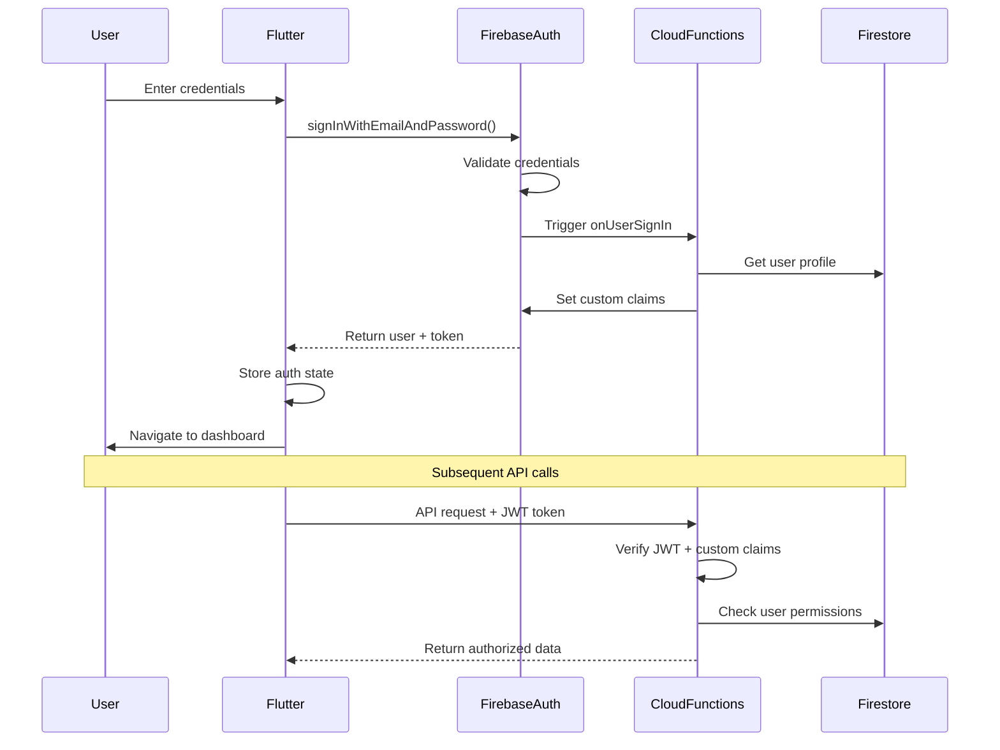

# Backend Architecture

## Service Architecture

### Function Organization

```
cannasoltech_automation/functions/
├── main.py                     # Main Cloud Functions entry point
├── requirements.txt            # Python dependencies
├── serviceAccountKey.json      # Firebase service account credentials
├── constants.py                # Application constants and configuration
├── common.py                   # Common utilities and helper functions
├── simulation.py               # Device simulation and hardware interface
├── device_timers.py           # Device timing and scheduling logic
├── gen_ai.py                  # AI/ML integration for analytics
└── venv/                      # Python virtual environment
    ├── Lib/                   # Python libraries
    ├── Scripts/               # Virtual environment scripts
    └── pyvenv.cfg            # Virtual environment configuration
```

### Function Template

```python
# main.py - Firebase Cloud Functions for Python
from functions_framework import http
from dataclasses import asdict, dataclass
from datetime import datetime, timezone, timedelta
from typing import List, Dict, Any, Optional
from firebase_functions import https_fn, db_fn
import firebase_admin as admin
from firebase_admin import auth, db, messaging, exceptions, firestore
import json
import logging
from constants import *
from simulation import *
from common import *

# Initialize Firebase Admin SDK
cred = admin.credentials.Certificate("serviceAccountKey.json")
admin.initialize_app(cred)

# Setup logging
logging.basicConfig(level=logging.INFO)
logger = logging.getLogger(__name__)

@dataclass
class EnvironmentConditions:
    temperature: float
    humidity: float
    co2: float
    light_level: float
    soil_moisture: float
    ph: float
    last_updated: datetime

@dataclass
class AlertData:
    facility_id: str
    environment_id: Optional[str]
    device_id: Optional[str]
    alert_type: str
    severity: str
    message: str
    status: str
    triggered_at: datetime
    metadata: Dict[str, Any]

# HTTP Cloud Function for API endpoints
@https_fn.on_request()
def api(req):
    """Main API endpoint handler"""
    try:
        # CORS handling
        if req.method == 'OPTIONS':
            headers = {
                'Access-Control-Allow-Origin': '*',
                'Access-Control-Allow-Methods': 'GET, POST, PUT, DELETE',
                'Access-Control-Allow-Headers': 'Content-Type, Authorization',
                'Access-Control-Max-Age': '3600'
            }
            return ('', 204, headers)

        # Set CORS headers for actual requests
        headers = {'Access-Control-Allow-Origin': '*'}

        # Route handling
        path = req.path.strip('/')
        method = req.method

        if path.startswith('facilities'):
            return handle_facilities_request(req, headers)
        elif path.startswith('environments'):
            return handle_environments_request(req, headers)
        elif path.startswith('alerts'):
            return handle_alerts_request(req, headers)
        elif path.startswith('devices'):
            return handle_devices_request(req, headers)
        else:
            return ({'error': 'Not found'}, 404, headers)

    except Exception as e:
        logger.error(f"API error: {str(e)}")
        return ({'error': 'Internal server error'}, 500, {'Access-Control-Allow-Origin': '*'})

# Firestore trigger for environment updates
@db_fn.on_document_written(document="environments/{environment_id}")
def process_environment_update(event: db_fn.Event[db_fn.DocumentSnapshot | None]) -> None:
    """Process environment condition updates and check thresholds"""
    try:
        environment_id = event.params["environment_id"]

        if not event.data.after.exists:
            logger.info(f"Environment {environment_id} was deleted")
            return

        current_data = event.data.after.to_dict()
        previous_data = event.data.before.to_dict() if event.data.before.exists else None

        # Check for threshold violations
        check_environment_thresholds(environment_id, current_data, previous_data)

        # Update facility status if needed
        update_facility_status(current_data.get('facility_id'))

    except Exception as e:
        logger.error(f"Error processing environment update: {str(e)}")

# Firestore trigger for alert creation
@db_fn.on_document_written(document="alerts/{alert_id}")
def process_alert_creation(event: db_fn.Event[db_fn.DocumentSnapshot | None]) -> None:
    """Process new alerts and send notifications"""
    try:
        alert_id = event.params["alert_id"]

        if not event.data.after.exists:
            return

        alert_data = event.data.after.to_dict()
        is_new_alert = not event.data.before.exists

        if is_new_alert:
            # Send notifications for new alerts
            send_alert_notifications(alert_id, alert_data)

    except Exception as e:
        logger.error(f"Error processing alert creation: {str(e)}")

def check_environment_thresholds(environment_id: str, current_data: Dict, previous_data: Optional[Dict] = None):
    """Check environment conditions against thresholds and create alerts if needed"""
    try:
        current_conditions = current_data.get('current_conditions', {})
        target_ranges = current_data.get('target_ranges', {})

        for condition, value in current_conditions.items():
            if condition == 'last_updated':
                continue

            range_config = target_ranges.get(condition)
            if not range_config:
                continue

            min_val = range_config.get('min')
            max_val = range_config.get('max')

            if min_val is None or max_val is None:
                continue

            is_out_of_range = value < min_val or value > max_val

            # Check if this is a new violation
            was_out_of_range = False
            if previous_data:
                prev_value = previous_data.get('current_conditions', {}).get(condition)
                if prev_value is not None:
                    was_out_of_range = prev_value < min_val or prev_value > max_val

            if is_out_of_range and not was_out_of_range:
                create_environment_alert(environment_id, condition, value, range_config, current_data)

    except Exception as e:
        logger.error(f"Error checking environment thresholds: {str(e)}")

def create_environment_alert(environment_id: str, condition: str, value: float, range_config: Dict, environment_data: Dict):
    """Create a new environmental alert"""
    try:
        db = firestore.client()
        alerts_ref = db.collection('alerts')

        severity = get_severity_level(value, range_config)
        min_val = range_config.get('min')
        max_val = range_config.get('max')

        alert_data = {
            'facility_id': environment_data.get('facility_id'),
            'environment_id': environment_id,
            'type': 'environmental',
            'severity': severity,
            'message': f"{condition.replace('_', ' ').title()} is out of range: {value} (target: {min_val}-{max_val})",
            'status': 'active',
            'triggered_at': firestore.SERVER_TIMESTAMP,
            'metadata': {
                'threshold': range_config,
                'current_value': value,
                'condition': condition
            }
        }

        alerts_ref.add(alert_data)
        logger.info(f"Created alert for {condition} in environment {environment_id}")

    except Exception as e:
        logger.error(f"Error creating environment alert: {str(e)}")

def get_severity_level(value: float, range_config: Dict) -> str:
    """Determine alert severity based on how far out of range the value is"""
    min_val = range_config.get('min', 0)
    max_val = range_config.get('max', 100)

    if value < min_val:
        deviation = (min_val - value) / min_val
    else:
        deviation = (value - max_val) / max_val

    if deviation > 0.5:  # 50% or more out of range
        return 'critical'
    elif deviation > 0.25:  # 25-50% out of range
        return 'high'
    elif deviation > 0.1:  # 10-25% out of range
        return 'medium'
    else:
        return 'low'

def send_alert_notifications(alert_id: str, alert_data: Dict):
    """Send push notifications and other alerts"""
    try:
        # Get users who should receive this alert
        facility_id = alert_data.get('facility_id')
        severity = alert_data.get('severity')

        # Send Firebase Cloud Messaging notifications
        send_fcm_notification(facility_id, alert_data)

        # For critical alerts, also send email/SMS
        if severity == 'critical':
            send_email_notification(facility_id, alert_data)

    except Exception as e:
        logger.error(f"Error sending alert notifications: {str(e)}")

def send_fcm_notification(facility_id: str, alert_data: Dict):
    """Send Firebase Cloud Messaging notification"""
    try:
        # Implementation for FCM notifications
        message = messaging.Message(
            notification=messaging.Notification(
                title=f"Alert: {alert_data.get('type', '').title()}",
                body=alert_data.get('message', '')
            ),
            topic=f"facility_{facility_id}"  # Users subscribe to facility topics
        )

        response = messaging.send(message)
        logger.info(f"FCM notification sent: {response}")

    except Exception as e:
        logger.error(f"Error sending FCM notification: {str(e)}")
```

## Database Architecture

### Schema Design

```sql
-- BigQuery schema for analytics (time-series data)
CREATE TABLE `cannasol-tech.analytics.sensor_readings` (
  reading_id STRING NOT NULL,
  device_id STRING NOT NULL,
  environment_id STRING NOT NULL,
  facility_id STRING NOT NULL,
  timestamp TIMESTAMP NOT NULL,
  sensor_type STRING NOT NULL,
  value FLOAT64 NOT NULL,
  unit STRING NOT NULL,
  quality FLOAT64,
  metadata JSON,
  created_at TIMESTAMP DEFAULT CURRENT_TIMESTAMP()
)
PARTITION BY DATE(timestamp)
CLUSTER BY facility_id, environment_id, sensor_type;

CREATE TABLE `cannasol-tech.analytics.alerts_history` (
  alert_id STRING NOT NULL,
  facility_id STRING NOT NULL,
  environment_id STRING,
  device_id STRING,
  type STRING NOT NULL,
  severity STRING NOT NULL,
  message STRING NOT NULL,
  status STRING NOT NULL,
  triggered_at TIMESTAMP NOT NULL,
  acknowledged_at TIMESTAMP,
  resolved_at TIMESTAMP,
  duration_minutes INT64,
  metadata JSON,
  created_at TIMESTAMP DEFAULT CURRENT_TIMESTAMP()
)
PARTITION BY DATE(triggered_at)
CLUSTER BY facility_id, type, severity;

-- Views for common queries
CREATE VIEW `cannasol-tech.analytics.daily_environment_summary` AS
SELECT
  DATE(timestamp) as date,
  facility_id,
  environment_id,
  sensor_type,
  AVG(value) as avg_value,
  MIN(value) as min_value,
  MAX(value) as max_value,
  STDDEV(value) as stddev_value,
  COUNT(*) as reading_count
FROM `cannasol-tech.analytics.sensor_readings`
WHERE quality >= 0.8  -- Only high-quality readings
GROUP BY 1, 2, 3, 4;
```

### Data Access Layer

```typescript
import { getFirestore, FieldValue } from 'firebase-admin/firestore';
import { BigQuery } from '@google-cloud/bigquery';

export class EnvironmentRepository {
  private db = getFirestore();
  private bigquery = new BigQuery();

  async getEnvironment(environmentId: string): Promise<Environment | null> {
    const doc = await this.db.collection('environments').doc(environmentId).get();
    return doc.exists ? Environment.fromFirestore(doc) : null;
  }

  async updateEnvironmentConditions(
    environmentId: string,
    conditions: EnvironmentConditions
  ): Promise<void> {
    await this.db.collection('environments').doc(environmentId).update({
      currentConditions: conditions,
      updatedAt: FieldValue.serverTimestamp(),
    });
  }

  async getEnvironmentsByFacility(facilityId: string): Promise<Environment[]> {
    const snapshot = await this.db
      .collection('environments')
      .where('facilityId', '==', facilityId)
      .get();

    return snapshot.docs.map(doc => Environment.fromFirestore(doc));
  }

  async getSensorReadings(
    environmentId: string,
    startTime: Date,
    endTime: Date,
    sensorType?: string
  ): Promise<SensorReading[]> {
    let query = this.db
      .collection('environments')
      .doc(environmentId)
      .collection('readings')
      .where('timestamp', '>=', startTime)
      .where('timestamp', '<=', endTime)
      .orderBy('timestamp', 'desc');

    if (sensorType) {
      query = query.where('sensorType', '==', sensorType);
    }

    const snapshot = await query.limit(1000).get();
    return snapshot.docs.map(doc => SensorReading.fromFirestore(doc));
  }

  async getAnalyticsData(
    facilityId: string,
    startDate: string,
    endDate: string
  ): Promise<any[]> {
    const query = `
      SELECT
        date,
        environment_id,
        sensor_type,
        avg_value,
        min_value,
        max_value
      FROM \`cannasol-tech.analytics.daily_environment_summary\`
      WHERE facility_id = @facilityId
        AND date BETWEEN @startDate AND @endDate
      ORDER BY date DESC, environment_id, sensor_type
    `;

    const [rows] = await this.bigquery.query({
      query,
      params: { facilityId, startDate, endDate },
    });

    return rows;
  }
}

export class AlertRepository {
  private db = getFirestore();

  async createAlert(alert: Omit<Alert, 'id'>): Promise<string> {
    const docRef = await this.db.collection('alerts').add({
      ...alert,
      triggeredAt: FieldValue.serverTimestamp(),
    });
    return docRef.id;
  }

  async acknowledgeAlert(alertId: string, userId: string): Promise<void> {
    await this.db.collection('alerts').doc(alertId).update({
      status: 'acknowledged',
      acknowledgedAt: FieldValue.serverTimestamp(),
      acknowledgedBy: userId,
    });
  }

  async resolveAlert(alertId: string, userId: string): Promise<void> {
    await this.db.collection('alerts').doc(alertId).update({
      status: 'resolved',
      resolvedAt: FieldValue.serverTimestamp(),
      resolvedBy: userId,
    });
  }

  async getActiveAlerts(facilityIds: string[]): Promise<Alert[]> {
    const snapshot = await this.db
      .collection('alerts')
      .where('facilityId', 'in', facilityIds)
      .where('status', '==', 'active')
      .orderBy('triggeredAt', 'desc')
      .limit(100)
      .get();

    return snapshot.docs.map(doc => Alert.fromFirestore(doc));
  }
}

## Authentication and Authorization

### Auth Flow



### Middleware/Guards

```typescript
import { Request, Response, NextFunction } from 'express';
import { getAuth } from 'firebase-admin/auth';
import { getFirestore } from 'firebase-admin/firestore';

export interface AuthenticatedRequest extends Request {
  user: {
    uid: string;
    email: string;
    role: string;
    facilities: string[];
  };
}

export async function authMiddleware(
  req: Request,
  res: Response,
  next: NextFunction
): Promise<void> {
  try {
    const authHeader = req.headers.authorization;
    if (!authHeader || !authHeader.startsWith('Bearer ')) {
      res.status(401).json({ error: 'Unauthorized: Missing or invalid token' });
      return;
    }

    const token = authHeader.split('Bearer ')[1];
    const decodedToken = await getAuth().verifyIdToken(token);

    // Get user profile from Firestore
    const userDoc = await getFirestore()
      .collection('users')
      .doc(decodedToken.uid)
      .get();

    if (!userDoc.exists) {
      res.status(401).json({ error: 'User profile not found' });
      return;
    }

    const userData = userDoc.data()!;

    (req as AuthenticatedRequest).user = {
      uid: decodedToken.uid,
      email: decodedToken.email!,
      role: userData.role,
      facilities: userData.facilities || [],
    };

    next();
  } catch (error) {
    console.error('Auth middleware error:', error);
    res.status(401).json({ error: 'Unauthorized: Invalid token' });
  }
}

export function requireRole(roles: string[]) {
  return (req: Request, res: Response, next: NextFunction): void => {
    const user = (req as AuthenticatedRequest).user;

    if (!user || !roles.includes(user.role)) {
      res.status(403).json({
        error: 'Forbidden: Insufficient permissions',
        required: roles,
        current: user?.role
      });
      return;
    }

    next();
  };
}

export function requireFacilityAccess(facilityIdParam: string = 'facilityId') {
  return (req: Request, res: Response, next: NextFunction): void => {
    const user = (req as AuthenticatedRequest).user;
    const facilityId = req.params[facilityIdParam];

    if (!user || !user.facilities.includes(facilityId)) {
      res.status(403).json({
        error: 'Forbidden: No access to this facility',
        facilityId
      });
      return;
    }

    next();
  };
}

// Usage example in routes
import { Router } from 'express';
import { authMiddleware, requireRole, requireFacilityAccess } from '../middleware/auth';

const router = Router();

// All routes require authentication
router.use(authMiddleware);

// Get facilities (user can only see their own)
router.get('/facilities', async (req: Request, res: Response) => {
  const user = (req as AuthenticatedRequest).user;
  // Implementation here
});

// Create facility (admin/manager only)
router.post('/facilities',
  requireRole(['admin', 'manager']),
  async (req: Request, res: Response) => {
    // Implementation here
  }
);

// Update facility (admin/manager only, must have facility access)
router.put('/facilities/:facilityId',
  requireRole(['admin', 'manager']),
  requireFacilityAccess(),
  async (req: Request, res: Response) => {
    // Implementation here
  }
);
```

# Unified Project Structure

```plaintext
cannasol-technologies-mobile-app/
├── .github/                    # CI/CD workflows
│   └── workflows/
│       ├── ci.yaml            # Continuous integration
│       ├── deploy-functions.yaml
│       └── deploy-flutter.yaml
├── lib/                        # Flutter application
│   ├── main.dart              # App entry point
│   ├── app/                   # App-level configuration
│   │   ├── app.dart          # Main app widget
│   │   ├── router.dart       # Go Router configuration
│   │   └── theme.dart        # Material Design 3 theme
│   ├── core/                  # Core utilities and services
│   │   ├── constants/        # App constants
│   │   ├── errors/           # Error handling
│   │   ├── utils/            # Utility functions
│   │   └── extensions/       # Dart extensions
│   ├── features/              # Feature-based organization
│   │   ├── auth/             # Authentication feature
│   │   │   ├── data/         # Repositories, data sources
│   │   │   ├── domain/       # Entities, use cases
│   │   │   └── presentation/ # Pages, widgets, providers
│   │   ├── dashboard/        # Dashboard feature
│   │   ├── facilities/       # Facility management
│   │   ├── environments/     # Environment monitoring
│   │   ├── alerts/           # Alert management
│   │   └── settings/         # User settings
│   ├── shared/                # Shared components
│   │   ├── widgets/          # Reusable UI components
│   │   ├── models/           # Shared data models
│   │   └── services/         # Shared services
│   └── firebase_options.dart  # Firebase configuration
├── functions/                  # Firebase Cloud Functions
│   ├── src/
│   │   ├── index.ts          # Main exports
│   │   ├── config/           # Configuration
│   │   ├── middleware/       # Express middleware
│   │   ├── routes/           # API routes
│   │   ├── services/         # Business logic
│   │   ├── models/           # Data models
│   │   ├── utils/            # Utility functions
│   │   └── triggers/         # Firestore triggers
│   ├── package.json
│   ├── tsconfig.json
│   └── .env.example
├── cloud_run/                  # Python services for IoT
│   ├── device_processor/
│   │   ├── main.py           # FastAPI application
│   │   ├── models/           # Pydantic models
│   │   ├── services/         # Business logic
│   │   ├── utils/            # Utility functions
│   │   ├── requirements.txt
│   │   └── Dockerfile
│   └── analytics_processor/
│       ├── main.py
│       ├── models/
│       ├── services/
│       ├── requirements.txt
│       └── Dockerfile
├── shared/                     # Shared TypeScript types
│   ├── types/                 # TypeScript interfaces
│   │   ├── user.ts
│   │   ├── facility.ts
│   │   ├── environment.ts
│   │   ├── alert.ts
│   │   └── device.ts
│   ├── constants/             # Shared constants
│   └── utils/                 # Shared utilities
├── infrastructure/             # Infrastructure as Code
│   ├── terraform/             # Terraform configurations
│   │   ├── main.tf
│   │   ├── variables.tf
│   │   └── outputs.tf
│   └── firebase/              # Firebase configuration
│       ├── firestore.rules
│       ├── firestore.indexes.json
│       ├── storage.rules
│       └── firebase.json
├── docs/                       # Documentation
│   ├── prd/                   # Sharded PRD documents
│   ├── architecture/          # Sharded architecture documents
│   ├── api/                   # API documentation
│   └── deployment/            # Deployment guides
├── scripts/                    # Build and deployment scripts
│   ├── build.sh              # Build all services
│   ├── deploy.sh             # Deploy to production
│   ├── test.sh               # Run all tests
│   └── setup.sh              # Initial project setup
├── test/                       # Integration and E2E tests
│   ├── integration/          # Integration tests
│   └── e2e/                  # End-to-end tests
├── .env.example                # Environment template
├── pubspec.yaml                # Flutter dependencies
├── firebase.json               # Firebase configuration
├── .firebaserc                 # Firebase project aliases
├── analysis_options.yaml      # Dart analysis options
└── README.md                   # Project documentation
