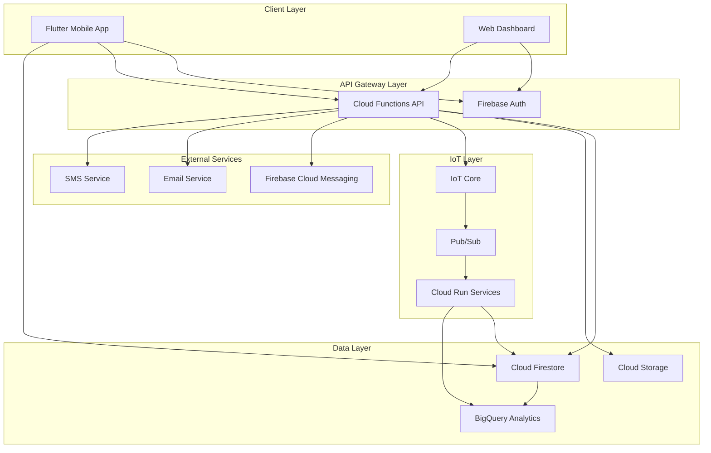

# Components

## Mobile Application (Flutter)

**Responsibility:** Primary user interface for cannabis monitoring system, providing real-time facility monitoring, alert management, and device control capabilities

**Key Interfaces:**
- Firebase Authentication SDK for user management
- Cloud Firestore SDK for real-time data synchronization
- Firebase Cloud Messaging for push notifications
- Cloud Functions HTTP API for complex operations

**Dependencies:** Firebase SDK, Riverpod state management, Material Design 3 components

**Technology Stack:** Flutter 3.16+, Dart 3.2+, Firebase SDK, Riverpod, Material Design 3

## Authentication Service (Firebase Auth)

**Responsibility:** Manages user authentication, authorization, and session management across all platforms

**Key Interfaces:**
- Email/password authentication
- Multi-factor authentication
- Custom claims for role-based access control
- Token refresh and validation

**Dependencies:** Firebase Auth service, Cloud Functions for custom claims

**Technology Stack:** Firebase Authentication, Custom Claims via Cloud Functions

## Real-time Data Service (Cloud Firestore)

**Responsibility:** Primary data store with real-time synchronization, offline support, and automatic conflict resolution

**Key Interfaces:**
- Real-time listeners for live data updates
- Offline-first data access with automatic sync
- Security rules for data access control
- Batch operations for bulk updates

**Dependencies:** Firebase SDK, Security Rules engine

**Technology Stack:** Cloud Firestore, Firebase Security Rules

## Backend Logic Service (Cloud Functions)

**Responsibility:** Serverless backend processing for complex business logic, data validation, and external integrations

**Key Interfaces:**
- HTTP endpoints for API operations
- Firestore triggers for data processing
- Pub/Sub triggers for IoT data processing
- Scheduled functions for maintenance tasks

**Dependencies:** Cloud Firestore, IoT Core, Pub/Sub, external APIs

**Technology Stack:** Node.js 18, TypeScript, Firebase Functions SDK

## IoT Device Management (Cloud Run + IoT Core)

**Responsibility:** Manages IoT device connectivity, data ingestion, and device control commands

**Key Interfaces:**
- MQTT broker for device communication
- Device registry and authentication
- Telemetry data processing
- Device command and control

**Dependencies:** Google Cloud IoT Core, Pub/Sub, Cloud Functions

**Technology Stack:** Python 3.11, Google Cloud IoT Core SDK, MQTT

## Alert Processing Service (Cloud Functions)

**Responsibility:** Monitors environmental conditions, triggers alerts based on thresholds, and manages alert lifecycle

**Key Interfaces:**
- Real-time condition monitoring
- Alert threshold evaluation
- Notification dispatch (FCM, email, SMS)
- Alert escalation and acknowledgment

**Dependencies:** Cloud Firestore, Firebase Cloud Messaging, external notification services

**Technology Stack:** Node.js 18, TypeScript, Firebase Functions SDK

## Analytics and Reporting (BigQuery + Cloud Functions)

**Responsibility:** Processes historical data for analytics, generates reports, and provides insights for optimization

**Key Interfaces:**
- Data pipeline from Firestore to BigQuery
- Scheduled report generation
- Data visualization APIs
- Machine learning model integration

**Dependencies:** BigQuery, Cloud Functions, Firestore

**Technology Stack:** BigQuery, Python 3.11, TensorFlow (for ML models)

## Component Diagrams

