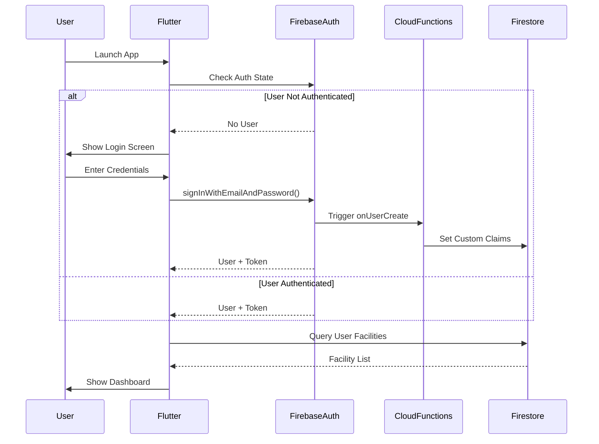
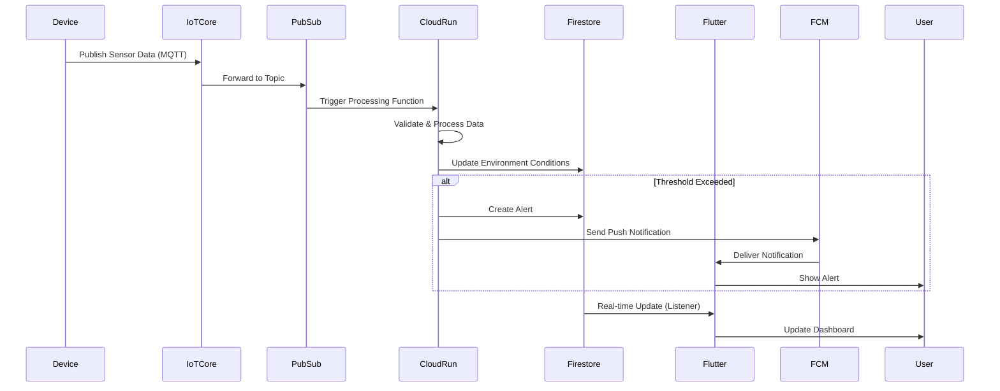
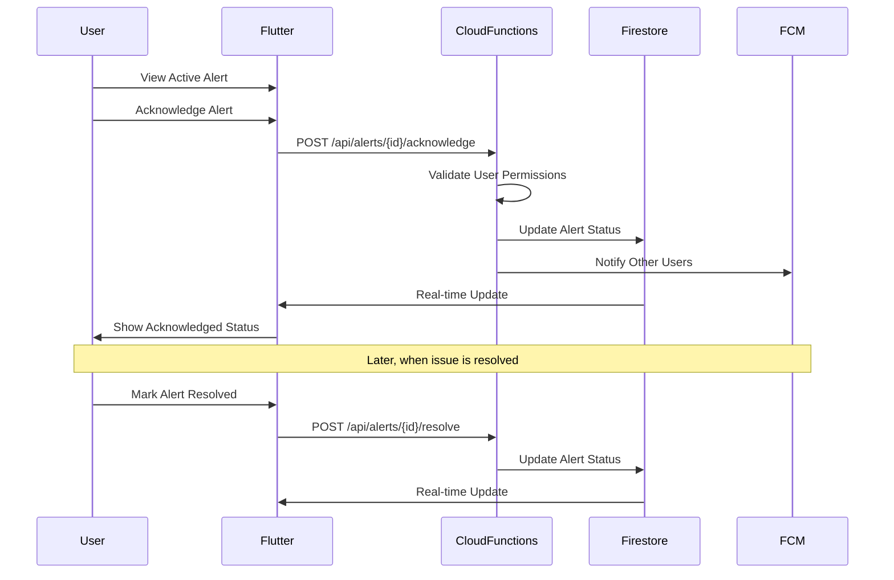

# Core Workflows

## User Authentication and Facility Access

```mermaid
sequenceDiagram
    participant User
    participant Flutter
    participant FirebaseAuth
    participant CloudFunctions
    participant Firestore

    User->>Flutter: Launch App
    Flutter->>FirebaseAuth: Check Auth State

    alt User Not Authenticated
        FirebaseAuth-->>Flutter: No User
        Flutter->>User: Show Login Screen
        User->>Flutter: Enter Credentials
        Flutter->>FirebaseAuth: signInWithEmailAndPassword()
        FirebaseAuth->>CloudFunctions: Trigger onUserCreate
        CloudFunctions->>Firestore: Set Custom Claims
        FirebaseAuth-->>Flutter: User + Token
    else User Authenticated
        FirebaseAuth-->>Flutter: User + Token
    end

    Flutter->>Firestore: Query User Facilities
    Firestore-->>Flutter: Facility List
    Flutter->>User: Show Dashboard
```

## Real-time Environmental Monitoring

```mermaid
sequenceDiagram
    participant Device
    participant IoTCore
    participant PubSub
    participant CloudRun
    participant Firestore
    participant Flutter
    participant FCM

    Device->>IoTCore: Publish Sensor Data (MQTT)
    IoTCore->>PubSub: Forward to Topic
    PubSub->>CloudRun: Trigger Processing Function

    CloudRun->>CloudRun: Validate & Process Data
    CloudRun->>Firestore: Update Environment Conditions

    alt Threshold Exceeded
        CloudRun->>Firestore: Create Alert
        CloudRun->>FCM: Send Push Notification
        FCM->>Flutter: Deliver Notification
        Flutter->>User: Show Alert
    end

    Firestore->>Flutter: Real-time Update (Listener)
    Flutter->>User: Update Dashboard
```

## Alert Acknowledgment and Resolution

```mermaid
sequenceDiagram
    participant User
    participant Flutter
    participant CloudFunctions
    participant Firestore
    participant FCM

    User->>Flutter: View Active Alert
    User->>Flutter: Acknowledge Alert
    Flutter->>CloudFunctions: POST /api/alerts/{id}/acknowledge

    CloudFunctions->>CloudFunctions: Validate User Permissions
    CloudFunctions->>Firestore: Update Alert Status
    CloudFunctions->>FCM: Notify Other Users

    Firestore->>Flutter: Real-time Update
    Flutter->>User: Show Acknowledged Status

    Note over User,FCM: Later, when issue is resolved

    User->>Flutter: Mark Alert Resolved
    Flutter->>CloudFunctions: POST /api/alerts/{id}/resolve
    CloudFunctions->>Firestore: Update Alert Status
    Firestore->>Flutter: Real-time Update
```
