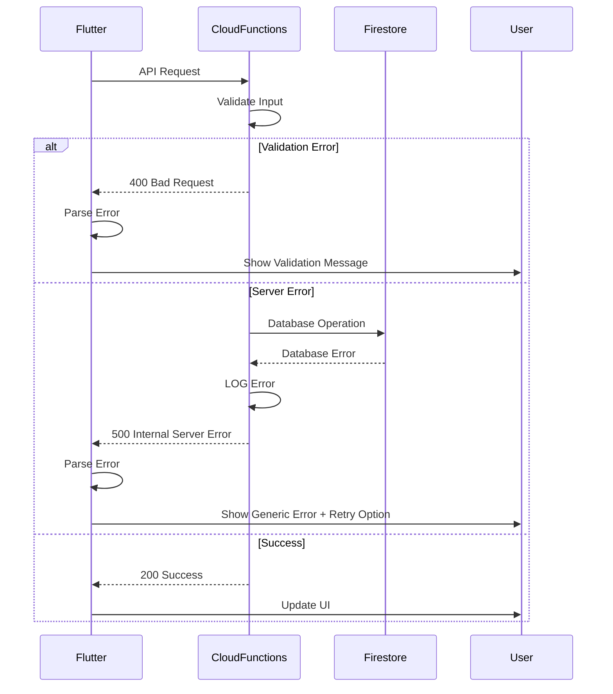

# Error Handling Strategy

## Error Flow



## Error Response Format

```typescript
interface ApiError {
  error: {
    code: string;
    message: string;
    details?: Record<string, any>;
    timestamp: string;
    requestId: string;
  };
}
```

## Frontend Error Handling

```typescript
class ApiException implements Exception {
  final String code;
  final String message;
  final Map<String, dynamic>? details;
  final String? requestId;

  ApiException({
    required this.code,
    required this.message,
    this.details,
    this.requestId,
  });

  factory ApiException.fromResponse(Response response) {
    final data = response.data;
    return ApiException(
      code: data['error']['code'],
      message: data['error']['message'],
      details: data['error']['details'],
      requestId: data['error']['requestId'],
    );
  }

  @override
  String toString() => 'ApiException: $message (Code: $code)';
}

// Global error handler
class GlobalErrorHandler {
  static void handleError(Object error, StackTrace stackTrace) {
    if (error is ApiException) {
      _handleApiError(error);
    } else if (error is FirebaseException) {
      _handleFirebaseError(error);
    } else {
      _handleUnknownError(error, stackTrace);
    }
  }

  static void _handleApiError(ApiException error) {
    // Show user-friendly error message
    // LOG error for debugging
    // Optionally retry based on error code
  }
}
```

## Backend Error Handling

```typescript
export class AppError extends Error {
  public readonly statusCode: number;
  public readonly code: string;
  public readonly isOperational: boolean;

  constructor(
    message: string,
    statusCode: number = 500,
    code: string = 'INTERNAL_ERROR',
    isOperational: boolean = true
  ) {
    super(message);
    this.statusCode = statusCode;
    this.code = code;
    this.isOperational = isOperational;

    Error.captureStackTrace(this, this.constructor);
  }
}

export const errorHandler = (
  error: Error,
  req: Request,
  res: Response,
  next: NextFunction
): void => {
  const requestId = req.headers['x-request-id'] || generateRequestId();

  if (error instanceof AppError) {
    logger.error('Operational error:', {
      requestId,
      code: error.code,
      message: error.message,
      statusCode: error.statusCode,
      stack: error.stack,
    });

    res.status(error.statusCode).json({
      error: {
        code: error.code,
        message: error.message,
        timestamp: new Date().toISOString(),
        requestId,
      },
    });
  } else {
    logger.error('Unexpected error:', {
      requestId,
      message: error.message,
      stack: error.stack,
    });

    res.status(500).json({
      error: {
        code: 'INTERNAL_ERROR',
        message: 'An unexpected error occurred',
        timestamp: new Date().toISOString(),
        requestId,
      },
    });
  }
};
```
