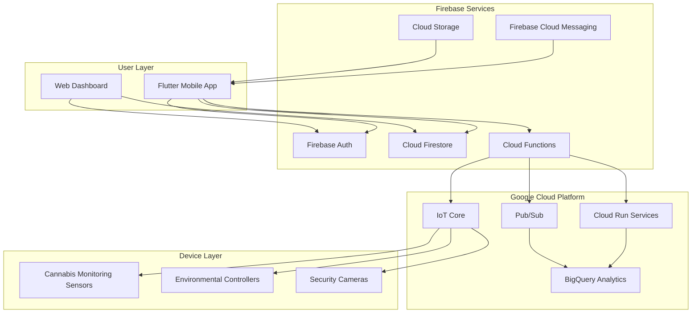

# High Level Architecture

## Technical Summary

The Cannasol Technologies Mobile App employs a Firebase-centric serverless architecture with Flutter as the primary mobile interface, leveraging Cloud Firestore for real-time data synchronization and Firebase Cloud Functions for backend processing. The system integrates with **Industrial Ultrasonic Liquid Processing equipment** through Firebase Realtime Database and custom Python Cloud Functions, while utilizing Google Cloud Platform services for advanced analytics and machine learning capabilities. This architecture ensures offline-first functionality for mobile users, real-time monitoring of **ultrasonic processing systems, pumps, sonicators, and temperature control** across multiple industrial facilities, and seamless scalability through Google's managed services infrastructure.

## Platform and Infrastructure Choice

**Platform:** Google Cloud Platform (Firebase + GCP Services)
**Key Services:** Firebase Auth, Cloud Firestore, Cloud Functions, Cloud Run, IoT Core, Cloud Storage, Firebase Hosting
**Deployment Host and Regions:** Multi-region (us-central1, us-east1) with global CDN via Firebase Hosting

## Repository Structure

**Structure:** Monorepo with Flutter app and Cloud Functions
**Monorepo Tool:** Firebase CLI with workspace organization
**Package Organization:** 
- `/lib` - Flutter application code
- `/functions` - Firebase Cloud Functions (Node.js/TypeScript)
- `/cloud_run` - Python services for device integration
- `/shared` - Shared data models and utilities

## High Level Architecture Diagram

## Architectural Patterns

- **Firebase-First Architecture:** Leverage Firebase services as primary backend with GCP extensions - _Rationale:_ Minimizes complexity while providing enterprise-grade scalability and real-time capabilities
- **Offline-First Mobile:** Flutter app functions fully offline with automatic sync - _Rationale:_ Critical for cultivation facilities with intermittent connectivity
- **Event-Driven Processing:** Cloud Functions triggered by Firestore changes and IoT events - _Rationale:_ Enables real-time responses to device alerts and environmental changes
- **CQRS Pattern:** Separate read/write models for device data vs user interactions - _Rationale:_ Optimizes performance for high-frequency sensor data while maintaining user experience
- **Repository Pattern:** Abstract data access through service layers - _Rationale:_ Enables testing and future migration flexibility while maintaining clean architecture
